# Guia: PostgreSQL + Patroni no Debian 13 e Enterprise Linux

## Sobre este guia

Este guia documenta a criação de um **cluster PostgreSQL de alta disponibilidade com Patroni** em um ambiente de laboratório local. O objetivo é entender o funcionamento e a configuração do cluster antes de aplicar em produção.

O lab usa três VMs provisionadas automaticamente com:

- [VirtualBox](https://www.virtualbox.org/): hypervisor local para as VMs
- [Vagrant](https://developer.hashicorp.com/vagrant): provisionamento e gerenciamento das VMs via linha de comando

Os IPs da rede privada (`172.27.11.x`) são atribuídos pelo VirtualBox. As senhas e versões são placeholders de laboratório. **Substitua por valores reais antes de usar em produção**.

| Parâmetro | Valor usado aqui |
|---|---|
| PostgreSQL | 17 |
| Rede privada | `172.27.11.0/24` |
| Senhas | placeholders (troque por senhas fortes) |

> Os prints exibidos neste documento foram gerados em ambiente de laboratório local. Usuários, senhas e configurações mostrados nas imagens são apenas ilustrativos e não devem ser replicados em produção.

---

## O que é o Patroni?

[Patroni](https://patroni.readthedocs.io/en/latest/) é uma solução de **alta disponibilidade (HA) para PostgreSQL** desenvolvida em Python, criada originalmente pela Zalando e mantida pela comunidade. Ele gerencia um cluster de nós PostgreSQL (1 primário + N réplicas) e oferece:

- **Eleição de líder** via DCS (Distributed Configuration Store): garante que apenas um nó seja primário por vez, evitando split-brain
- **Failover automático**: detecta falha do primário e promove a réplica mais atualizada sem intervenção manual
- **Replicação gerenciada**: configura e monitora o streaming replication do PostgreSQL
- **API REST**: expõe o estado do cluster em `http://<ip>:8008/patroni` para monitoramento e automação
- **`patronictl`**: CLI para operar o cluster (switchover, failover, reinit, restart, etc.)

### O papel do DCS

O Patroni não decide sozinho quem é o primário: ele delega essa decisão a um **DCS** (etcd, Consul ou ZooKeeper). O DCS funciona como árbitro distribuído: garante que todos os nós concordem sobre quem é o líder e armazena a configuração do cluster. Neste guia usamos o **etcd**, instalado nos próprios nós.

---

## Arquitetura

### Como o Patroni funciona

O Patroni é um **agente** que roda em cada nó e gerencia o processo PostgreSQL local. Cada nó tem três camadas: o PostgreSQL, o Patroni sobre ele, e o etcd como árbitro distribuído.

```
      db1 — Leader            db2 — Réplica           db3 — Réplica
   172.27.11.10             172.27.11.20             172.27.11.30
  ┌──────────────┐         ┌──────────────┐         ┌──────────────┐
  │  PostgreSQL  │         │  PostgreSQL  │         │  PostgreSQL  │
  │    :5432     │────────►│    :5432     │         │    :5432     │
  │   (escrita)  │  WAL    │  (leitura)  │◄────────│  (leitura)  │
  └──────▲───────┘         └──────▲───────┘         └──────▲───────┘
         │ gerencia               │ gerencia               │ gerencia
  ┌──────┴───────┐         ┌──────┴───────┐         ┌──────┴───────┐
  │   Patroni    │         │   Patroni    │         │   Patroni    │
  │    :8008     │         │    :8008     │         │    :8008     │
  └──────┬───────┘         └──────┬───────┘         └──────┬───────┘
         │ lê/escreve             │ lê                     │ lê
  ┌──────┴───────┐         ┌──────┴───────┐         ┌──────┴───────┐
  │     etcd     │◄───────►│     etcd     │◄───────►│     etcd     │
  │  :2379/2380  │  Raft   │  :2379/2380  │  Raft   │  :2379/2380  │
  └──────────────┘         └──────────────┘         └──────────────┘
```

**O que cada camada faz:**

| Camada | Responsabilidade |
|---|---|
| **etcd** | Árbitro distribuído. Armazena quem é o leader e a configuração do cluster. Usa o protocolo Raft para garantir que todos os nós concordem com o mesmo estado. |
| **Patroni** | Agente local. Lê o estado do etcd, gerencia o PostgreSQL do próprio nó (inicia, para, promove) e renova a chave de líder periodicamente enquanto for o primário. |
| **PostgreSQL** | Banco de dados. O leader recebe escrita e envia o WAL para as réplicas via streaming replication. As réplicas aplicam o WAL e ficam disponíveis para leitura. |

**Fluxo de failover automático:**

1. O leader para de renovar a chave no etcd (travou, caiu ou perdeu rede)
2. A chave expira após o TTL configurado
3. As réplicas percebem a chave vaga e disputam a liderança via Raft no etcd
4. A réplica mais atualizada vence e grava a nova chave de líder
5. O Patroni do vencedor promove o PostgreSQL local a primário

---

### Número de nós: topologias possíveis

O padrão recomendado é **3 nós**, mas o Patroni suporta outras configurações.

#### 3 nós (recomendado)

```
  db1 (Leader)   db2 (Réplica)   db3 (Réplica)
  etcd           etcd            etcd
```

O etcd com 3 nós tolera a falha de **1 nó** e ainda mantém quorum (2 de 3). É o mínimo para ter HA real. Usado neste lab.

#### 5 nós ou mais

Aumenta a tolerância a falhas. Um cluster de 5 nós etcd tolera a falha de **2 nós** simultaneamente. Recomendado para ambientes críticos. O número de nós do etcd deve ser sempre **ímpar** (3, 5, 7...) para facilitar o quorum.

#### 2 nós (não recomendado)

É possível subir Patroni com 2 nós PostgreSQL, mas **não é recomendado por três razões:**

**1. Quorum impossível após qualquer falha.**
O etcd com 2 nós exige 2 de 2 para ter quorum. Se 1 nó cair, o etcd perde quorum e trava. Sem etcd funcionando, o Patroni não consegue eleger um novo leader e o failover automático não acontece. O cluster fica parado mesmo com 1 nó PostgreSQL em pé.

**2. Risco de split-brain.**
Se a rede entre os dois nós cair (mas ambos continuam funcionando), cada nó pode acreditar que o outro morreu. Sem um terceiro nó para desempatar no etcd, não há como garantir que apenas um vire primário. Os dois podem tentar aceitar escrita ao mesmo tempo, corrompendo os dados.

**3. Nenhuma vantagem real sobre replicação simples.**
Com 2 nós, o failover manual já cobre o caso de uso. A complexidade do Patroni não compensa sem a garantia de quorum que o 3° nó provê.

> **Alternativa viável com 2 nós PostgreSQL:** manter o etcd em **3 servidores dedicados** separados dos nós de banco. Assim o etcd tem quorum independente do estado dos nós PostgreSQL. Essa topologia é comum em produção quando os servidores de banco são caros e o etcd roda em VMs leves.

---

### Hosts do lab

| Host | IP | Papel |
|---|---|---|
| db1 | 172.27.11.10 | Leader inicial |
| db2 | 172.27.11.20 | Replica |
| db3 | 172.27.11.30 | Replica |

O Patroni precisa de um **DCS (Distributed Configuration Store)**. Vamos usar o **etcd** nos próprios nós.

---

## 1. Pré-requisitos: todos os nós

**Debian 13:**
```bash
apt update && apt install -y curl gnupg2 lsb-release apt-transport-https ca-certificates
```

**EL (RHEL 9 / Rocky 9 / AlmaLinux 9):**
```bash
dnf install -y curl gnupg2
```

---

## 2. Instalar PostgreSQL: todos os nós

Repositório oficial: [postgresql.org/download](https://www.postgresql.org/download/)

**Debian 13** ([instruções](https://www.postgresql.org/download/linux/debian/)):
```bash
apt install -y postgresql-common
/usr/share/postgresql-common/pgdg/apt.postgresql.org.sh

apt update && apt install -y postgresql-17

systemctl stop postgresql
systemctl disable postgresql
```

**EL** ([instruções](https://www.postgresql.org/download/linux/redhat/)):
```bash
dnf install -y https://download.postgresql.org/pub/repos/yum/reporpms/EL-9-x86_64/pgdg-redhat-repo-latest.noarch.rpm
dnf -qy module disable postgresql
dnf install -y postgresql17-server

systemctl stop postgresql-17
systemctl disable postgresql-17
```

---

## 3. Instalar etcd: todos os nós

Documentação oficial: [etcd.io](https://etcd.io/) | [GitHub](https://github.com/etcd-io/etcd)

O `etcd` não está disponível nos repositórios oficiais do Debian nem do EPEL 9. Em ambas as distros, instale via binário oficial:

```bash
# Busca a versão mais recente automaticamente
ETCD_VER=$(curl -sSL https://api.github.com/repos/etcd-io/etcd/releases/latest \
  | grep '"tag_name"' | cut -d'"' -f4)

curl -sSL https://github.com/etcd-io/etcd/releases/download/${ETCD_VER}/etcd-${ETCD_VER}-linux-amd64.tar.gz \
  -o /tmp/etcd.tar.gz

tar -xzf /tmp/etcd.tar.gz -C /tmp/
mv /tmp/etcd-${ETCD_VER}-linux-amd64/etcd    /usr/local/bin/
mv /tmp/etcd-${ETCD_VER}-linux-amd64/etcdctl /usr/local/bin/
rm -rf /tmp/etcd-${ETCD_VER}-linux-amd64 /tmp/etcd.tar.gz

useradd -r -s /sbin/nologin etcd 2>/dev/null || true
mkdir -p /var/lib/etcd/default
chown -R etcd:etcd /var/lib/etcd
```

**EL:** crie também o diretório de configuração:

```bash
mkdir -p /etc/etcd
```

### Serviço systemd para etcd: todos os nós

Como a instalação é via binário em ambas as distros, crie o serviço manualmente:

```bash
cat > /etc/systemd/system/etcd.service << 'EOF'
[Unit]
Description=etcd key-value store
After=network.target

[Service]
Type=notify
User=etcd
EnvironmentFile=/etc/default/etcd
ExecStart=/usr/local/bin/etcd
Restart=on-failure
RestartSec=10
TimeoutStartSec=120
LimitNOFILE=65536

[Install]
WantedBy=multi-user.target
EOF
```

> **EL:** troque `EnvironmentFile=/etc/default/etcd` por `EnvironmentFile=/etc/etcd/etcd.conf`.

### Configurar etcd

O arquivo de configuração varia por distro, mas o conteúdo é idêntico:

| Distro | Arquivo |
|--------|---------|
| Debian | `/etc/default/etcd` |
| EL | `/etc/etcd/etcd.conf` |

**db1 (172.27.11.10):**
```bash
cat > /etc/default/etcd << 'EOF'
ETCD_NAME="db1"
ETCD_DATA_DIR="/var/lib/etcd/default"
ETCD_LISTEN_PEER_URLS="http://172.27.11.10:2380"
ETCD_LISTEN_CLIENT_URLS="http://172.27.11.10:2379,http://127.0.0.1:2379"
ETCD_INITIAL_ADVERTISE_PEER_URLS="http://172.27.11.10:2380"
ETCD_ADVERTISE_CLIENT_URLS="http://172.27.11.10:2379"
ETCD_INITIAL_CLUSTER="db1=http://172.27.11.10:2380,db2=http://172.27.11.20:2380,db3=http://172.27.11.30:2380"
ETCD_INITIAL_CLUSTER_STATE="new"
ETCD_INITIAL_CLUSTER_TOKEN="etcd-pg-cluster"
ETCD_AUTO_COMPACTION_MODE="periodic"
ETCD_AUTO_COMPACTION_RETENTION="1h"
EOF
```

**db2 (172.27.11.20):**
```bash
cat > /etc/default/etcd << 'EOF'
ETCD_NAME="db2"
ETCD_DATA_DIR="/var/lib/etcd/default"
ETCD_LISTEN_PEER_URLS="http://172.27.11.20:2380"
ETCD_LISTEN_CLIENT_URLS="http://172.27.11.20:2379,http://127.0.0.1:2379"
ETCD_INITIAL_ADVERTISE_PEER_URLS="http://172.27.11.20:2380"
ETCD_ADVERTISE_CLIENT_URLS="http://172.27.11.20:2379"
ETCD_INITIAL_CLUSTER="db1=http://172.27.11.10:2380,db2=http://172.27.11.20:2380,db3=http://172.27.11.30:2380"
ETCD_INITIAL_CLUSTER_STATE="new"
ETCD_INITIAL_CLUSTER_TOKEN="etcd-pg-cluster"
ETCD_AUTO_COMPACTION_MODE="periodic"
ETCD_AUTO_COMPACTION_RETENTION="1h"
EOF
```

**db3 (172.27.11.30):**
```bash
cat > /etc/default/etcd << 'EOF'
ETCD_NAME="db3"
ETCD_DATA_DIR="/var/lib/etcd/default"
ETCD_LISTEN_PEER_URLS="http://172.27.11.30:2380"
ETCD_LISTEN_CLIENT_URLS="http://172.27.11.30:2379,http://127.0.0.1:2379"
ETCD_INITIAL_ADVERTISE_PEER_URLS="http://172.27.11.30:2380"
ETCD_ADVERTISE_CLIENT_URLS="http://172.27.11.30:2379"
ETCD_INITIAL_CLUSTER="db1=http://172.27.11.10:2380,db2=http://172.27.11.20:2380,db3=http://172.27.11.30:2380"
ETCD_INITIAL_CLUSTER_STATE="new"
ETCD_INITIAL_CLUSTER_TOKEN="etcd-pg-cluster"
ETCD_AUTO_COMPACTION_MODE="periodic"
ETCD_AUTO_COMPACTION_RETENTION="1h"
EOF
```

### Iniciar etcd: todos os nós

```bash
systemctl daemon-reload
systemctl enable etcd
systemctl start etcd --no-block
```

```bash
# Verificar saúde do cluster
etcdctl --endpoints=http://127.0.0.1:2379 endpoint health
etcdctl --endpoints=http://172.27.11.10:2379,http://172.27.11.20:2379,http://172.27.11.30:2379 member list
```

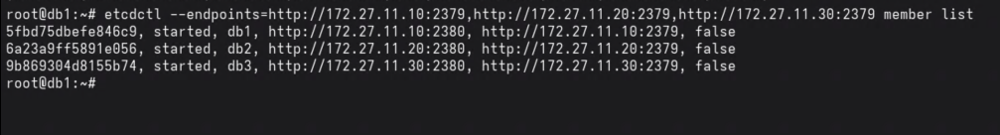

### Manutenção: defrag periódico: todos os nós

A compactação automática (`ETCD_AUTO_COMPACTION_MODE/RETENTION`) remove revisões antigas dos dados do etcd, mas não libera espaço em disco: o arquivo de banco de dados do etcd só encolhe com o **defrag**. Sem defrag periódico, o arquivo cresce indefinidamente mesmo com compactação ativa.

Crie o diretório de log e instale o cron no usuário `root` de cada nó:

```bash
mkdir -p /var/log/etcd
```

```bash
# Adicionar via: crontab -e (root), em cada nó separadamente
# Toda madrugada de domingo às 2h, desfragmenta o membro local
0 2 * * 0 echo "=== $(date) ===" >> /var/log/etcd/etcd-defrag.log 2>&1 && \
  /usr/local/bin/etcdctl --endpoints=http://127.0.0.1:2379 \
  --command-timeout=60s defrag >> /var/log/etcd/etcd-defrag.log 2>&1
```

O endpoint `127.0.0.1:2379` refere-se sempre ao membro local, então o mesmo cron serve para os três nós sem ajuste de IP. O defrag causa uma pausa breve no membro enquanto o arquivo é reescrito; como cada nó desfragmenta a si mesmo de forma independente, o cluster como um todo permanece disponível durante a operação.

Sem defrag periódico, o banco de dados interno do etcd pode atingir o limite de tamanho configurado (`--quota-backend-bytes`, padrão 2 GB). Quando isso acontece, o etcd entra em modo de alarme, para de aceitar escritas e o Patroni perde a capacidade de renovar a chave de líder, o que derruba o cluster inteiro.

---

## 4. Instalar Patroni: todos os nós

Documentação oficial: [patroni.readthedocs.io](https://patroni.readthedocs.io/en/latest/) | [GitHub](https://github.com/patroni/patroni)

**Debian 13:**
```bash
apt install -y python3 python3-pip python3-dev python3-psycopg2 python3-yaml binutils
pip3 install patroni[etcd3] --break-system-packages
patroni --version
```

**EL:**
```bash
dnf install -y python3 python3-pip python3-devel python3-psycopg2 python3-pyyaml binutils
pip3 install patroni[etcd3] --break-system-packages
patroni --version
```


---

## 5. Configurar Patroni (`/etc/patroni/patroni.yml`)

**db1:**
```bash
mkdir -p /etc/patroni

cat > /etc/patroni/patroni.yml << 'EOF'
scope: pg-cluster
namespace: /db/
name: db1

restapi:
  listen: 172.27.11.10:8008
  connect_address: 172.27.11.10:8008

etcd3:
  hosts: 172.27.11.10:2379,172.27.11.20:2379,172.27.11.30:2379

bootstrap:
  dcs:
    ttl: 30
    loop_wait: 10
    retry_timeout: 10
    maximum_lag_on_failover: 1048576
    postgresql:
      use_pg_rewind: true
      use_slots: true
      parameters:
        wal_level: replica
        hot_standby: "on"
        max_connections: 100
        max_wal_senders: 10
        max_replication_slots: 10
        wal_log_hints: "on"

  initdb:
    - encoding: UTF8
    - data-checksums

  pg_hba:
    - host replication replicator 172.27.11.0/24 md5
    - host all all 0.0.0.0/0 md5

  users:
    admin:
      password: troque_por_senha_forte
      options:
        - createrole
        - createdb

postgresql:
  listen: 172.27.11.10:5432
  connect_address: 172.27.11.10:5432
  data_dir: /var/lib/postgresql/17/main
  bin_dir: /usr/lib/postgresql/17/bin
  pgpass: /tmp/pgpass0
  authentication:
    replication:
      username: replicator
      password: troque_por_senha_forte
    superuser:
      username: postgres
      password: troque_por_senha_forte
    rewind:
      username: rewind_user
      password: troque_por_senha_forte

  parameters:
    unix_socket_directories: '/var/run/postgresql'

tags:
  nofailover: false
  noloadbalance: false
  clonefrom: false
  nosync: false
EOF
```

> **EL:** nos três nós, altere `data_dir` para `/var/lib/pgsql/17/data` e `bin_dir` para `/usr/pgsql-17/bin`.

**db2**: mesmo arquivo, substituindo o `name` e os IPs de `restapi`, `postgresql.listen` e `postgresql.connect_address`:
```bash
sed 's/db1/db2/g; s/172\.27\.11\.10/172.27.11.20/g' /etc/patroni/patroni.yml > /tmp/patroni_db2.yml
# Copie /tmp/patroni_db2.yml para /etc/patroni/patroni.yml no db2
```

**db3**: mesma lógica:
```bash
sed 's/db1/db3/g; s/172\.27\.11\.10/172.27.11.30/g' /etc/patroni/patroni.yml > /tmp/patroni_db3.yml
```

---

### Entendendo os parâmetros

**Seção raiz**

| Parâmetro | Descrição |
|---|---|
| `scope` | Nome do cluster no DCS. Todos os nós devem ter o mesmo valor. |
| `namespace` | Prefixo do path no etcd onde o Patroni guarda o estado do cluster. |
| `name` | Identificador único deste nó dentro do cluster. |

**restapi**

| Parâmetro | Descrição |
|---|---|
| `listen` | IP e porta onde o Patroni expõe a API REST (monitoramento, HAProxy, etc.). |
| `connect_address` | Endereço que outros nós e ferramentas externas usam para acessar esta API. Deve ser o IP da rede privada. |

**etcd3**

| Parâmetro | Descrição |
|---|---|
| `hosts` | Lista de todos os endpoints do etcd. O Patroni tenta cada um até conseguir conexão. |

**bootstrap.dcs**

Configurações escritas no DCS durante o bootstrap e aplicadas a todos os nós. Alterações posteriores são feitas via `patronictl edit-config`.

| Parâmetro | Descrição |
|---|---|
| `ttl` | TTL (s) da chave de líder no etcd. Se o líder não renovar dentro desse tempo, os demais nós assumem que ele caiu. |
| `loop_wait` | Intervalo (s) entre cada ciclo de health check do Patroni. |
| `retry_timeout` | Tempo máximo (s) para tentar uma operação no DCS ou PostgreSQL antes de desistir e considerar falha. |
| `maximum_lag_on_failover` | Lag máximo em bytes que uma réplica pode ter para ser candidata a líder. `1048576` = 1 MB. Réplicas mais atrasadas são descartadas do failover. |
| `use_pg_rewind` | Permite ao Patroni usar `pg_rewind` para ressincronizar um ex-líder com o novo sem precisar recriar a réplica por completo. Requer `wal_log_hints = on`. |
| `use_slots` | Usa replication slots para garantir que o WAL não seja descartado antes de todas as réplicas consumirem. |

**bootstrap.dcs.postgresql.parameters**

Parâmetros do PostgreSQL gerenciados pelo Patroni e aplicados via DCS a todos os nós.

| Parâmetro | Descrição |
|---|---|
| `wal_level: replica` | Nível mínimo de WAL para replicação streaming. |
| `hot_standby: on` | Permite queries de leitura nas réplicas enquanto estão em standby. |
| `max_connections` | Máximo de conexões simultâneas. Deve ser igual em todos os nós. |
| `max_wal_senders` | Máximo de processos de envio de WAL. Deve ser maior que o número de réplicas. |
| `max_replication_slots` | Máximo de replication slots disponíveis. |
| `wal_log_hints: on` | Escreve hints de página no WAL. Necessário para `pg_rewind`. |

**bootstrap.initdb**

Opções passadas ao `initdb` na criação do cluster. Só se aplicam uma vez.

| Parâmetro | Descrição |
|---|---|
| `encoding: UTF8` | Encoding padrão do cluster. |
| `data-checksums` | Ativa checksums nas páginas de dados. Detecta corrupção silenciosa e é exigido pelo `pg_rewind`. |

**bootstrap.pg_hba**

Regras escritas no `pg_hba.conf` durante o initdb. Linhas adicionadas na ordem em que aparecem.

**bootstrap.users**

Usuários criados automaticamente pelo Patroni no initdb, com as options do PostgreSQL (roles).

**postgresql**

| Parâmetro | Descrição |
|---|---|
| `listen` | IP e porta onde o PostgreSQL escuta. Use `0.0.0.0:5432` para escutar em todas as interfaces. |
| `connect_address` | Endereço que outros nós e o Patroni usam para conectar a este PostgreSQL. |
| `data_dir` | Diretório de dados do PostgreSQL. Deve estar vazio para o Patroni executar o `initdb`. |
| `bin_dir` | Diretório dos binários do PostgreSQL (`pg_ctl`, `initdb`, etc.). |
| `pgpass` | Arquivo temporário onde o Patroni grava credenciais para uso interno do `pg_basebackup`. |
| `authentication.replication` | Usuário e senha para replicação streaming entre nós. |
| `authentication.superuser` | Usuário e senha do superusuário `postgres`. |
| `authentication.rewind` | Usuário e senha para execução do `pg_rewind`. |
| `parameters.unix_socket_directories` | Diretório dos sockets Unix do PostgreSQL. |

**tags**

Controlam o comportamento do nó no cluster. Úteis para operações de manutenção.

| Tag | Descrição |
|---|---|
| `nofailover: false` | `true` exclui este nó do failover automático (nunca será promovido). |
| `noloadbalance: false` | `true` impede que HAProxy ou clients roteiem leitura para este nó. |
| `clonefrom: false` | `true` permite que outros nós clonem dados deste via `pg_basebackup`. |
| `nosync: false` | `true` impede que o nó seja usado como réplica síncrona em modo `synchronous_mode`. |

### Alterando parâmetros em runtime

O Patroni centraliza os parâmetros no DCS e os propaga para todos os nós automaticamente. Não edite o `patroni.yml` de cada nó individualmente para parâmetros gerenciados pelo DCS: use `patronictl edit-config`.

**Abrir editor interativo:**

```bash
patronictl -c /etc/patroni/patroni.yml edit-config pg-cluster
```

O editor exibe o YAML atual com os parâmetros do DCS. Salvar e fechar aplica a mudança.

**Aplicar um parâmetro direto na linha de comando:**

```bash
patronictl -c /etc/patroni/patroni.yml edit-config pg-cluster \
  --set 'postgresql.parameters.work_mem=16MB' --force
```

**Verificar a configuração atual do DCS:**

```bash
patronictl -c /etc/patroni/patroni.yml show-config
```

**Parâmetros que exigem reinício do PostgreSQL**

Após o `edit-config`, o Patroni marca os nós que precisam reiniciar com `pending restart`. Para aplicar:

```bash
# Reiniciar um nó específico
patronictl -c /etc/patroni/patroni.yml restart pg-cluster db2

# Ver quais nós estão com pending restart
patronictl -c /etc/patroni/patroni.yml list
```

Parâmetros que exigem reinício (exemplos): `max_connections`, `max_wal_senders`, `shared_buffers`, `wal_level`.
Parâmetros que aceitam reload (sem reinício): `work_mem`, `log_min_duration_statement`, `checkpoint_completion_target`.

### (Opcional) Senhas via variáveis de ambiente

Por padrão as senhas ficam diretamente no `patroni.yml`. Se preferir tirá-las do arquivo de configuração (útil para não versionar credenciais), o Patroni suporta sobrescrever qualquer chave via variáveis de ambiente no padrão `PATRONI_<SEÇÃO>_<CHAVE>`. Referência completa: [patroni.readthedocs.io/ENVIRONMENT](https://patroni.readthedocs.io/en/latest/ENVIRONMENT.html).

**1.** Crie `/etc/patroni/patroni.env` com as credenciais:

```bash
cat > /etc/patroni/patroni.env << 'EOF'
PATRONI_SUPERUSER_PASSWORD=troque_por_senha_forte
PATRONI_REPLICATION_PASSWORD=troque_por_senha_forte
PATRONI_REWIND_PASSWORD=troque_por_senha_forte
EOF

chmod 600 /etc/patroni/patroni.env
chown postgres:postgres /etc/patroni/patroni.env
```

**2.** No `patroni.yml`, remova os campos `password:` da seção `authentication` (as vars acima os substituem). A senha do `bootstrap.users` não tem suporte via env, precisa permanecer no YAML.

**3.** Adicione `EnvironmentFile=` ao serviço systemd:

```ini
[Service]
...
EnvironmentFile=/etc/patroni/patroni.env
ExecStart=/usr/local/bin/patroni /etc/patroni/patroni.yml
```

---

## 6. Configurar permissões e data dir: todos os nós

**Debian 13:**
```bash
rm -rf /var/lib/postgresql/17/main
mkdir -p /var/lib/postgresql/17/main
chown -R postgres:postgres /var/lib/postgresql/17
chmod 700 /var/lib/postgresql/17/main

mkdir -p /etc/patroni
chown postgres:postgres /etc/patroni/patroni.yml
```

**EL:**
```bash
rm -rf /var/lib/pgsql/17/data
mkdir -p /var/lib/pgsql/17/data
chown -R postgres:postgres /var/lib/pgsql/17
chmod 700 /var/lib/pgsql/17/data

mkdir -p /etc/patroni
chown postgres:postgres /etc/patroni/patroni.yml
```

---

## 7. Criar serviço systemd: todos os nós

```bash
cat > /etc/systemd/system/patroni.service << 'EOF'
[Unit]
Description=Patroni High Availability PostgreSQL Cluster
After=syslog.target network.target etcd.service

[Service]
Type=simple
User=postgres
Group=postgres
ExecStart=/usr/local/bin/patroni /etc/patroni/patroni.yml
ExecReload=/bin/kill -s HUP $MAINPID
KillMode=process
TimeoutSec=30
Restart=no

[Install]
WantedBy=multi-user.target
EOF

systemctl daemon-reload
systemctl enable patroni
```


---

## 8. Iniciar o cluster

```bash
# Iniciar primeiro no db1 (leader)
# No db1:
systemctl start patroni
journalctl -fu patroni  # acompanhar logs

# Após db1 estar UP, iniciar db2 e db3
systemctl start patroni
```

---

## 9. Verificar o cluster

```bash
# Em qualquer nó:
patronictl -c /etc/patroni/patroni.yml list
```

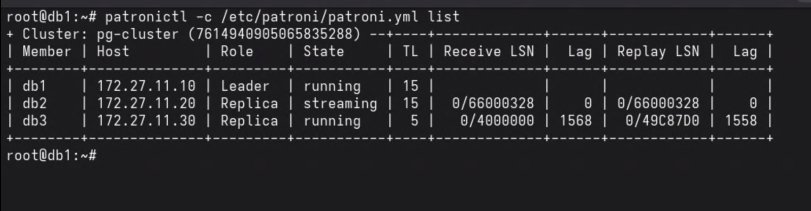

---

## 10. Comandos úteis

### Failover (não planejado)

Promove uma réplica a leader sem interação prévia, simulando falha do leader atual:

```bash
# Interativo (pergunta qual candidato):
patronictl -c /etc/patroni/patroni.yml failover pg-cluster

# Com candidato específico, sem confirmação:
patronictl -c /etc/patroni/patroni.yml failover pg-cluster --candidate db2 --force
```

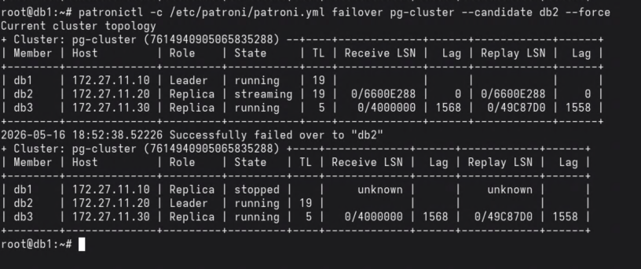

---

### Switchover (planejado)

Troca de leader de forma controlada. Ao contrário do failover, aguarda as réplicas estarem sincronizadas antes de promover:

```bash
# Interativo (pergunta master e candidato):
patronictl -c /etc/patroni/patroni.yml switchover pg-cluster

# Direto:
patronictl -c /etc/patroni/patroni.yml switchover pg-cluster --candidate db1 --scheduled now
```

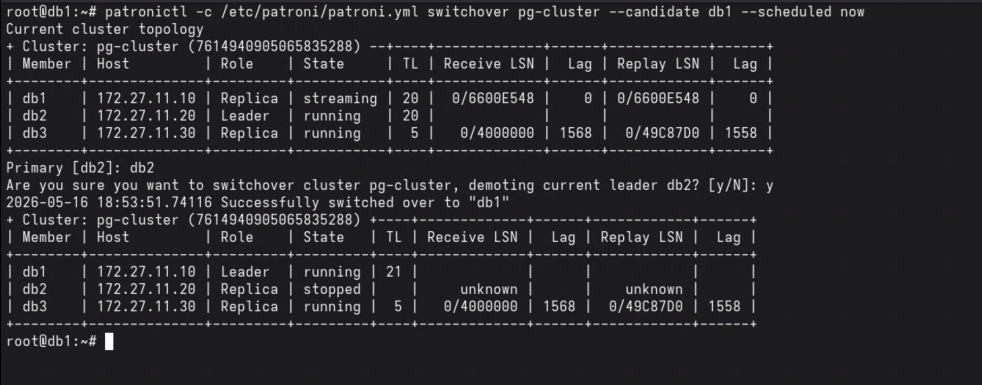

---

### Reinit de membro

Recria uma réplica do zero via `pg_basebackup`. Útil quando a réplica ficou muito defasada ou com dados corrompidos:

```bash
patronictl -c /etc/patroni/patroni.yml reinit pg-cluster db3

# Ver progresso após reinit:
patronictl -c /etc/patroni/patroni.yml list
```

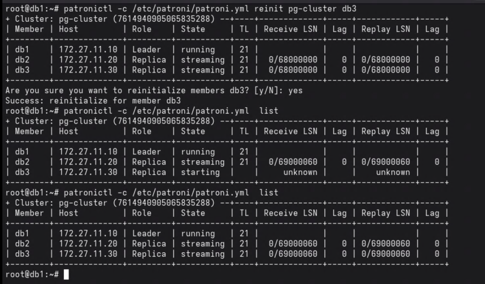

---

### Reiniciar membro

Reinicia o processo PostgreSQL de um membro específico sem remover a posição do cluster:

```bash
patronictl -c /etc/patroni/patroni.yml restart pg-cluster db2
```

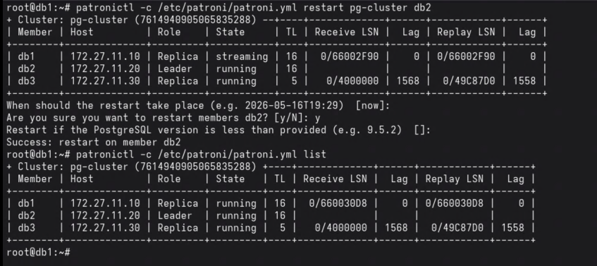

---

### Configuração DCS

```bash
# Ver configuração atual armazenada no etcd:
patronictl -c /etc/patroni/patroni.yml show-config

# Editar configuração (abre editor):
patronictl -c /etc/patroni/patroni.yml edit-config pg-cluster
```

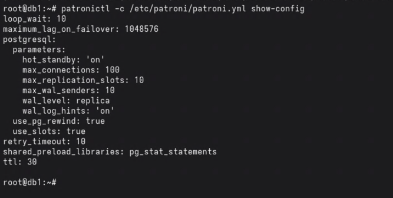

---

### Pausar e retomar o cluster

No modo pausado o Patroni não executa failover automático. Útil para manutenções:

```bash
patronictl -c /etc/patroni/patroni.yml pause pg-cluster
patronictl -c /etc/patroni/patroni.yml resume pg-cluster
```

---

### Status via API REST

```bash
# JSON detalhado de um nó:
curl http://172.27.11.10:8008/patroni | python3 -m json.tool

# Verificar se um nó é leader (útil em scripts e health checks):
curl -s -o /dev/null -w "%{http_code}" http://172.27.11.10:8008/master   # 200 = leader
curl -s -o /dev/null -w "%{http_code}" http://172.27.11.10:8008/replica  # 200 = réplica
```

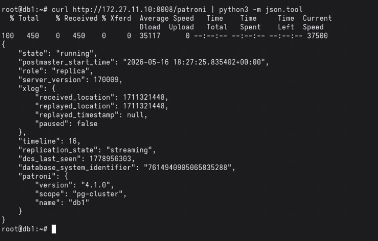

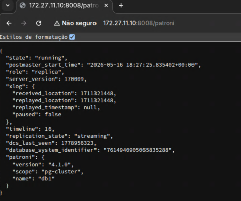

---

## Extra: Configurações avançadas do cluster

### Prioridade de failover por réplica

Por padrão todas as réplicas têm a mesma chance de serem promovidas. O campo `priority` na seção `tags` controla a preferência: o nó com maior valor é o candidato preferencial. O valor `0` impede a promoção do nó.

**Exemplo: db2 com prioridade alta, db3 nunca promovido:**

Edite o `patroni.yml` em cada nó (ou use `patronictl edit-config` para alterar via DCS):

```yaml
# db1 - prioridade padrão
tags:
  priority: 100
  nofailover: false
  noloadbalance: false

# db2 - prioridade mais alta (candidato preferencial)
tags:
  priority: 200
  nofailover: false
  noloadbalance: false

# db3 - nunca promovido
tags:
  priority: 0
  nofailover: true
  noloadbalance: false
```

Após editar o `patroni.yml`, recarregue o serviço no nó correspondente:

```bash
patronictl -c /etc/patroni/patroni.yml reload pg-cluster db3
```

Ou via `patronictl edit-config` para o campo ser propagado pelo DCS (apenas `nofailover` e `noloadbalance` são suportados no DCS; `priority` precisa ficar no `patroni.yml` local de cada nó).

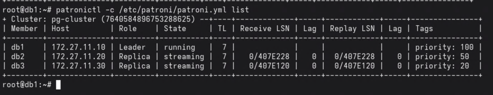

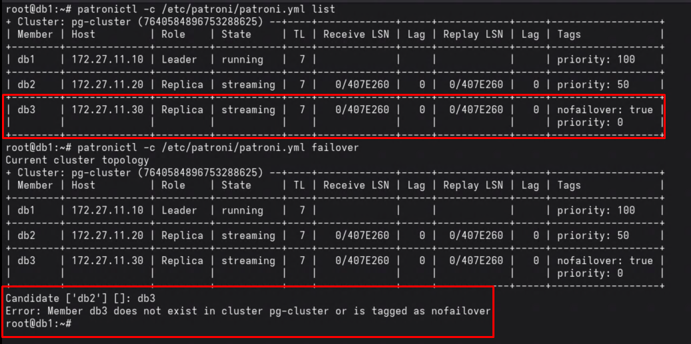

---

### Delay de replicação (réplica defasada)

Uma réplica com delay aplica os WALs com atraso intencional. Isso protege contra deleções ou corrupções acidentais: o dado ainda está disponível na réplica durante a janela de delay.

**Requisito:** o nó com delay não deve participar do failover automático (`nofailover: true`) nem do balanceamento de leitura (`noloadbalance: true`), pois seus dados estão propositalmente defasados.

**1.** Configure as tags no `patroni.yml` do nó de delay (ex: db3):

```yaml
tags:
  priority: 0
  nofailover: true
  noloadbalance: true
```

**2.** Adicione o parâmetro de delay no `patroni.yml` **do nó de delay** (ex: db3):

`recovery_min_apply_delay` é um parâmetro local de recuperação. Não use `patronictl edit-config` para isso: o `edit-config` grava no DCS e aplica em todos os nós do cluster. O parâmetro deve ficar na seção `postgresql.parameters` do `patroni.yml` apenas do nó de delay.

```yaml
# /etc/patroni/patroni.yml (somente no db3)
postgresql:
  parameters:
    recovery_min_apply_delay: '5min'
```

Após editar o arquivo, recarregue o Patroni nesse nó:

```bash
patronictl -c /etc/patroni/patroni.yml reload pg-cluster db3
```

O lag aparecerá no `patronictl list`:

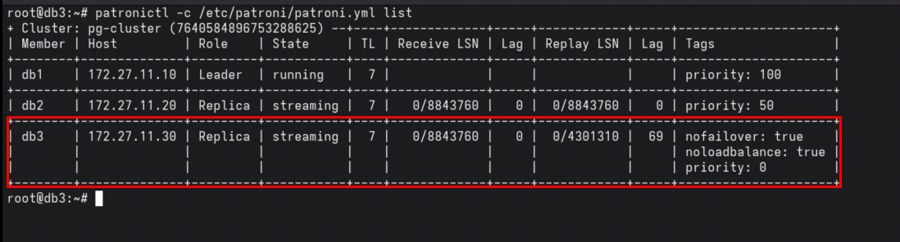

---

### Tablespaces em cluster Patroni

Um tablespace armazena dados do PostgreSQL em um diretório separado do `data_dir` padrão. Em cluster, **todos os nós precisam ter o mesmo diretório com as mesmas permissões**. Se um nó não tiver o diretório quando o Patroni tentar replicar um objeto no tablespace, a replicação falha.

**1.** Crie o diretório em todos os nós (db1, db2 e db3):

```bash
sudo mkdir -p /data/ts_teste
sudo chown postgres:postgres /data/ts_teste
sudo chmod 700 /data/ts_teste
```

**2.** Crie o tablespace no primário (apenas uma vez; replica para os outros via streaming):

```bash
psql -U postgres -c "CREATE TABLESPACE ts_teste LOCATION '/data/ts_teste';"
```

**3.** Verifique onde o tablespace está mapeado:

```bash
psql -U postgres -c "SELECT spcname, pg_tablespace_location(oid) FROM pg_tablespace;"
```

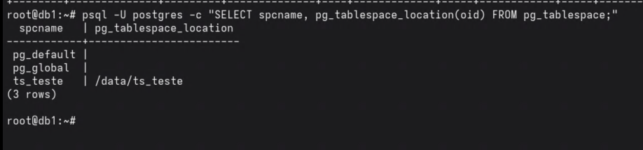

**O que acontece se o diretório não existir em uma réplica**

Se o diretório `/data/ts_teste` não existir no db3 quando houver objetos nesse tablespace, a replicação streaming falha e o nó entra em estado de erro:

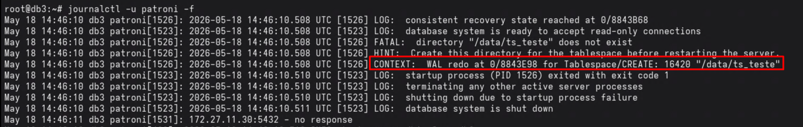

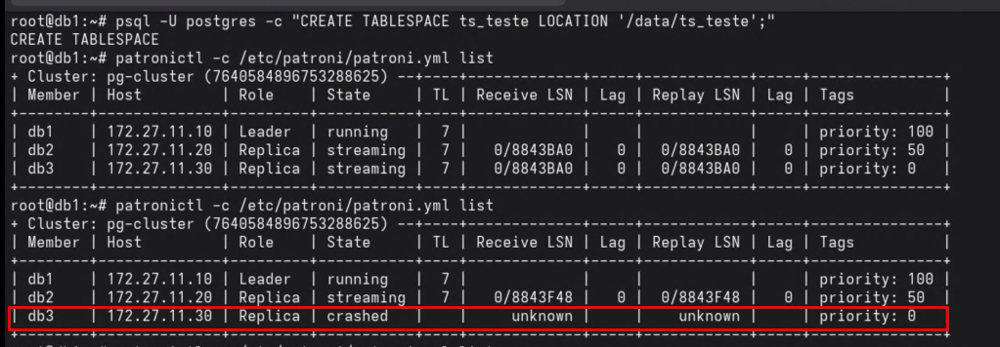

Para recuperar, crie o diretório no nó com problema:

```bash
# No nó com problema (db3):
sudo mkdir -p /data/ts_teste
sudo chown postgres:postgres /data/ts_teste
sudo chmod 700 /data/ts_teste
```

O Patroni detecta a recuperação e o nó reingressa no cluster automaticamente. Se o nó não voltar por conta própria, force um `reinit`:

```bash
patronictl -c /etc/patroni/patroni.yml reinit pg-cluster db3
```

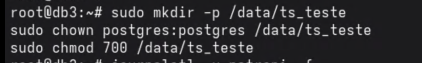

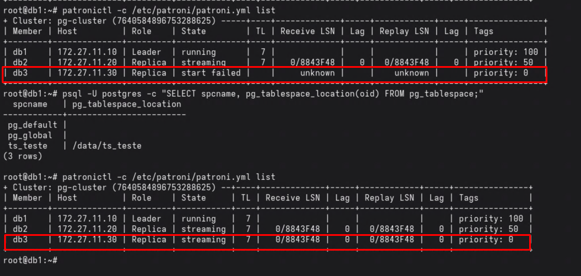

---

## Pontos de atenção

- **Ordem de boot**: suba o etcd em todos os nós antes de iniciar o Patroni.
- **Firewall**: libere as portas `2379`, `2380` (etcd), `5432` (PG) e `8008` (Patroni REST API) entre os nós.
- **data_dir limpo**: o Patroni faz o `initdb` automaticamente no leader e replica via `pg_basebackup` nas replicas. O diretório deve estar vazio.