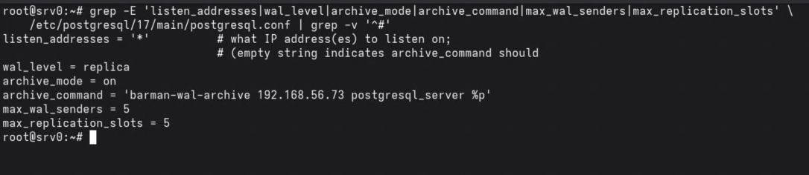
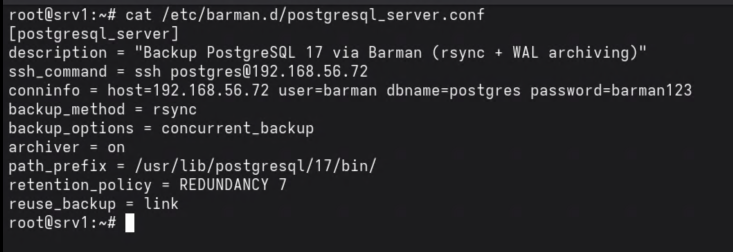
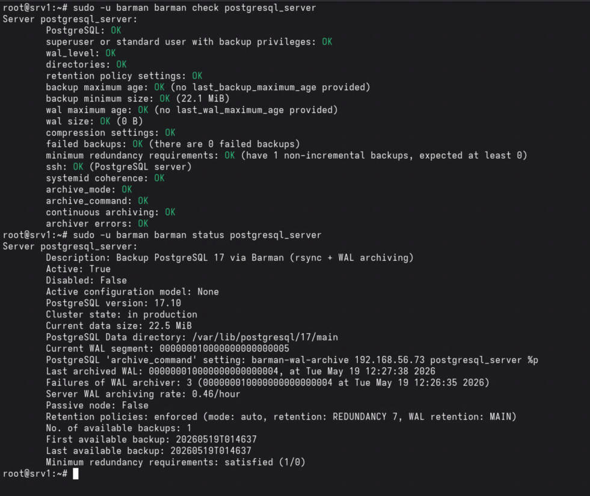
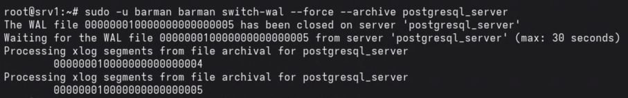
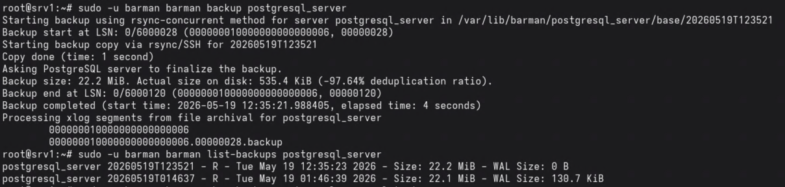
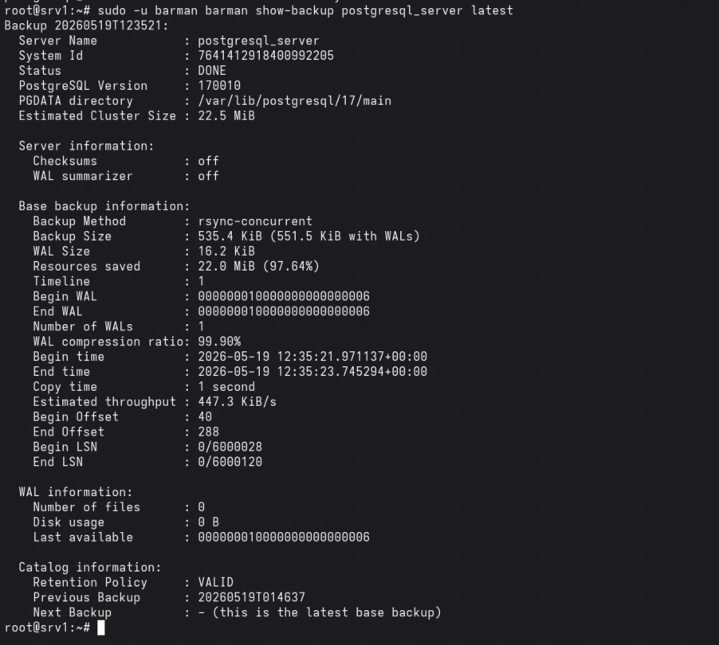
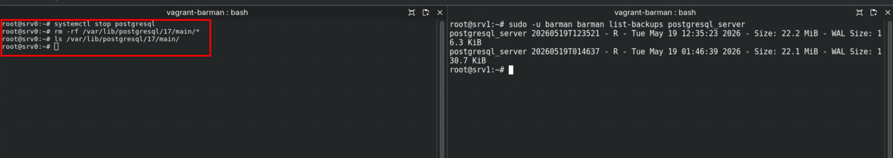
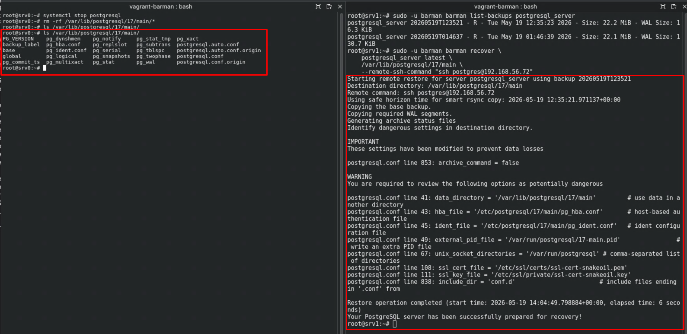
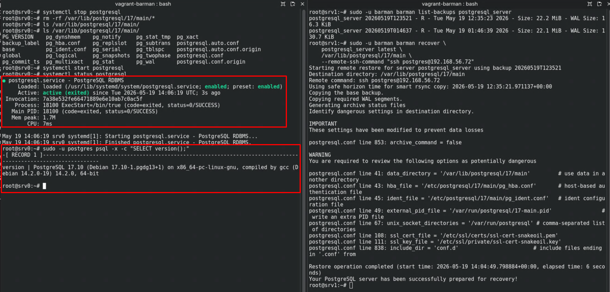
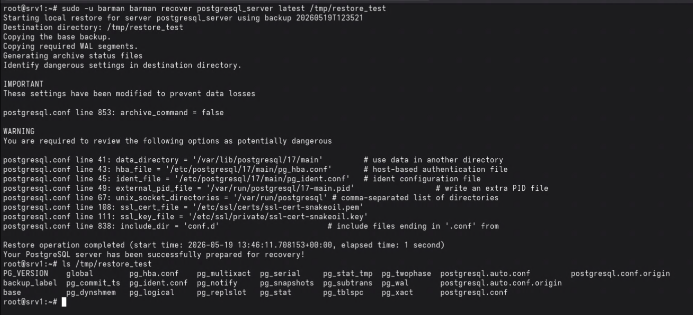

# Instalação, Configuração e Execução de Backup com o Barman

Neste documento, abordaremos a instalação do Barman, utilizado para realizar backups no PostgreSQL. Utilizamos duas máquinas virtuais: o servidor PostgreSQL e o servidor de backup Barman.

É importante ressaltar que, embora o Barman possa ser instalado diretamente no servidor de banco de dados, essa prática não é recomendada. O ideal é que os backups sejam mantidos em um servidor separado do servidor principal para garantir maior segurança e confiabilidade.

O Barman pode ser configurado para realizar backups via SSH/RSYNC ou por streaming, sem a necessidade de usar SSH.

> Os prints exibidos neste documento foram gerados em ambiente de laboratório local. Usuários, senhas e configurações mostrados nas imagens são apenas ilustrativos e não devem ser replicados em produção.

> Nota: Caso opte pelo backup via streaming, você pode **pular** as etapas de **criação e troca de chaves SSH**.


## Ambiente de Laboratório

| VM | IP | Role |
|----|----|------|
| srv0 | 192.168.56.72 | PostgreSQL 17 |
| srv1 | 192.168.56.73 | Barman |

Sistema operacional: Debian 13 (trixie). Onde os comandos diferirem para sistemas RHEL (Rocky Linux, AlmaLinux, CentOS Stream), a diferença será indicada.


## Instalação no Servidor PostgreSQL

Instale o cliente do Barman no servidor PostgreSQL:

**Debian:**
```bash
apt-get install -y barman-cli
```

**RHEL:**
```bash
dnf install barman-cli
```

Acesse o usuário `postgres` e gere o par de chaves SSH:

```bash
su - postgres
ssh-keygen -t rsa -b 3072
```

As chaves serão geradas no diretório `.ssh` do home do usuário `postgres`:

| Distribuição | Home do postgres |
|---|---|
| Debian | `/var/lib/postgresql` |
| RHEL | `/var/lib/pgsql` |

Agora que criamos as chaves de acesso, vamos seguir para o servidor do Barman para completar os próximos passos.


## Instalação no Servidor Barman

Configure o repositório PGDG e instale os pacotes:

**Debian:**
```bash
apt-get install -y postgresql-common
/usr/share/postgresql-common/pgdg/apt.postgresql.org.sh -y
apt-get install -y barman barman-cli postgresql-client-17
```

**RHEL:**
```bash
dnf install barman barman-cli postgresql17
```

> Em RHEL, o cliente PostgreSQL é nomeado conforme a versão instalada: `postgresql16`, `postgresql17` etc.

Acesse o usuário `barman` e gere o par de chaves SSH:

```bash
su - barman
ssh-keygen -t rsa -b 3072
```

O home do usuário `barman` é `/var/lib/barman` em ambas as distribuições.


## Troca de Chaves SSH

Após instalar o Barman nos dois servidores e criar as chaves de acesso, é necessário realizar a troca de chaves entre eles para permitir a execução dos comandos SSH e rsync.

Do servidor PostgreSQL (srv0), copiamos a chave do `postgres` para o servidor Barman (srv1):

```bash
postgres@srv0:~$ ssh-copy-id barman@192.168.56.73
```

Do servidor Barman (srv1), copiamos a chave do `barman` para o servidor PostgreSQL (srv0):

```bash
barman@srv1:~$ ssh-copy-id postgres@192.168.56.72
```

Após a troca, valide que o acesso sem senha funciona nos dois sentidos:

```bash
# Do PostgreSQL para o Barman
postgres@srv0:~$ ssh barman@192.168.56.73 "echo OK"

# Do Barman para o PostgreSQL
barman@srv1:~$ ssh postgres@192.168.56.72 "echo OK"
```

Se não tivermos acesso à senha dos usuários, tendo apenas acesso como root, copiamos manualmente a chave pública de cada usuário para o `authorized_keys` do outro servidor.

No servidor PostgreSQL (srv0), exibimos a chave pública do postgres:
```bash
postgres@srv0:~$ cat ~/.ssh/id_rsa.pub
```

No servidor Barman (srv1), adicionamos essa chave ao `authorized_keys` do barman:
```bash
barman@srv1:~$ echo "<chave copiada>" >> ~/.ssh/authorized_keys
```

Repetimos o processo no sentido inverso para a chave do barman.

> **Importante:** O Barman verifica que a conexão SSH não produz nenhuma saída inesperada (check `ssh output clean`). Para evitar warnings do tipo `Permanently added ... to the list of known hosts`, registre a host key do servidor PostgreSQL no `known_hosts` do usuário barman antes de executar o backup:
>
> ```bash
> root@srv1:~# ssh-keyscan -H 192.168.56.72 >> /var/lib/barman/.ssh/known_hosts
> root@srv1:~# chown barman:barman /var/lib/barman/.ssh/known_hosts
> ```


## Liberação do Usuário Barman no PostgreSQL

Crie o usuário barman no banco de dados. A forma mais simples é como superusuário:

```sql
CREATE USER barman WITH SUPERUSER ENCRYPTED PASSWORD 'sua_senha_aqui';
```

Caso prefira um usuário com privilégios mínimos, conceda apenas as permissões necessárias (PostgreSQL 15 e superior):

```sql
GRANT EXECUTE ON FUNCTION pg_backup_start(text, boolean) TO barman;
GRANT EXECUTE ON FUNCTION pg_backup_stop(boolean) TO barman;
GRANT EXECUTE ON FUNCTION pg_switch_wal() TO barman;
GRANT EXECUTE ON FUNCTION pg_create_restore_point(text) TO barman;
GRANT pg_read_all_settings TO barman;
GRANT pg_read_all_stats TO barman;
GRANT pg_checkpoint TO barman;
```

No `pg_hba.conf`, libere o acesso do usuário barman a partir do servidor Barman:

```
host  all         barman  192.168.56.73/32  scram-sha-256
host  replication barman  192.168.56.73/32  scram-sha-256
```

Recarregue as configurações:

**Debian:**
```bash
pg_ctlcluster 17 main reload
```

**RHEL:**
```bash
/usr/pgsql-17/bin/pg_ctl reload -D /var/lib/pgsql/17/data
```


## Backup via RSYNC

### Configurações do PostgreSQL

No `postgresql.conf`, habilite o arquivamento de WALs:

```
listen_addresses = '*'
wal_level = replica
archive_mode = on
archive_command = 'barman-wal-archive 192.168.56.73 postgresql_server %p'
max_wal_senders = 5
max_replication_slots = 5
```

O caminho do `postgresql.conf` difere entre distribuições:

| Distribuição | postgresql.conf |
|---|---|
| Debian | `/etc/postgresql/17/main/postgresql.conf` |
| RHEL | `/var/lib/pgsql/17/data/postgresql.conf` |



Reinicie o PostgreSQL para aplicar as alterações:

**Debian:**
```bash
systemctl restart postgresql
```

**RHEL:**
```bash
systemctl restart postgresql-17
```


### Configurações do Barman

Crie o arquivo `/etc/barman.d/postgresql_server.conf`:

```ini
[postgresql_server]
description = "Backup PostgreSQL 17 via Barman (rsync + WAL archiving)"
ssh_command = ssh postgres@192.168.56.72
conninfo = host=192.168.56.72 user=barman dbname=postgres password=sua_senha_aqui
backup_method = rsync
backup_options = concurrent_backup
archiver = on
path_prefix = /usr/lib/postgresql/17/bin/
retention_policy = REDUNDANCY 7
reuse_backup = link
```

O `path_prefix` aponta para os binários do PostgreSQL e difere entre distribuições:

| Distribuição | path_prefix |
|---|---|
| Debian | `/usr/lib/postgresql/17/bin/` |
| RHEL | `/usr/pgsql-17/bin/` |



Verifique se o ambiente está pronto para backup:

```bash
barman@srv1:~$ barman check postgresql_server
Server postgresql_server:
	PostgreSQL: OK
	superuser or standard user with backup privileges: OK
	wal_level: OK
	directories: OK
	retention policy settings: OK
	backup maximum age: OK (no last_backup_maximum_age provided)
	backup minimum size: OK (0 B)
	wal maximum age: OK (no last_wal_maximum_age provided)
	wal size: OK (0 B)
	compression settings: OK
	failed backups: OK (there are 0 failed backups)
	minimum redundancy requirements: OK (have 0 non-incremental backups, expected at least 0)
	ssh: OK (PostgreSQL server)
	ssh output clean: OK
	systemid coherence: OK (no system Id stored on disk)
	archive_mode: OK
	archive_command: OK
	continuous archiving: OK
	archiver errors: OK
```



Force o arquivamento do primeiro WAL e execute o primeiro backup:

```bash
barman@srv1:~$ barman switch-wal --force --archive postgresql_server
The WAL file 000000010000000000000002 has been closed on server 'postgresql_server'
Waiting for the WAL file 000000010000000000000002 from server 'postgresql_server' (max: 30 seconds)
Processing xlog segments from file archival for postgresql_server
	000000010000000000000002

barman@srv1:~$ barman backup postgresql_server
Starting backup using rsync-concurrent method for server postgresql_server in /var/lib/barman/postgresql_server/base/20260519T013921
Backup start at LSN: 0/3000028 (000000010000000000000003, 00000028)
This is the first backup for server postgresql_server
Starting backup copy via rsync/SSH for 20260519T013921
Copy done (time: 1 second)
Asking PostgreSQL server to finalize the backup.
Backup size: 22.2 MiB. Actual size on disk: 22.2 MiB (-0.00% deduplication ratio).
Backup end at LSN: 0/3000120 (000000010000000000000003, 00000120)
Backup completed (start time: 2026-05-19 01:39:21.580484, elapsed time: 5 seconds)
Processing xlog segments from file archival for postgresql_server
	000000010000000000000003
	000000010000000000000003.00000028.backup
```





Para adicionar também o arquivamento de WALs via streaming, inclua no `postgresql_server.conf`:

```ini
streaming_conninfo = host=192.168.56.72 user=barman dbname=postgres password=sua_senha_aqui
streaming_archiver = on
```

Caso o check `receive-wal running: FAILED` apareça após ativar o streaming, force a troca de WALs:

```bash
barman@srv1:~$ barman switch-wal --force --archive postgresql_server
```


## Backup via Streaming

No backup via streaming, o Barman usa `pg_basebackup` e os WALs são enviados via streaming, sem necessidade de SSH ou `archive_command`.

No `postgresql.conf`, comente ou remova o arquivamento:

```
#archive_mode = on
#archive_command = ''
```

No `postgresql_server.conf`, configure para o método `postgres` com slot de replicação:

```ini
[postgresql_server]
description = "Backup PostgreSQL 17 via Barman (streaming)"
conninfo = host=192.168.56.72 user=barman dbname=postgres password=sua_senha_aqui
backup_method = postgres
path_prefix = /usr/lib/postgresql/17/bin/
streaming_conninfo = host=192.168.56.72 user=barman dbname=postgres password=sua_senha_aqui
streaming_archiver = on
slot_name = barman
```

Crie e ative o slot de replicação:

```bash
barman@srv1:~$ barman receive-wal --create-slot postgresql_server
Creating physical replication slot 'barman' on server 'postgresql_server'
Replication slot 'barman' created

barman@srv1:~$ barman receive-wal postgresql_server
Starting receive-wal for server postgresql_server
postgresql_server: pg_receivewal: starting log streaming at 0/23000000 (timeline 1)
```

Verifique o slot no servidor PostgreSQL:

```sql
postgres=# SELECT slot_name, slot_type, active FROM pg_replication_slots;
 slot_name | slot_type | active
-----------+-----------+--------
 barman    | physical  | t
```

Execute o backup:

```bash
barman@srv1:~$ barman backup postgresql_server
Starting backup using postgres method for server postgresql_server in /var/lib/barman/postgresql_server/base/20260519T020000
Backup start at LSN: 0/37000060 (000000010000000000000037, 00000060)
Starting backup copy via pg_basebackup for 20260519T020000
Copy done (time: 2 seconds)
Finalising the backup.
Backup size: 22.4 MiB
Backup end at LSN: 0/39000000 (000000010000000000000038, 00000000)
Backup completed (start time: 2026-05-19 02:00:00.000000, elapsed time: 3 seconds)
```


## Descrição dos Campos de Configuração

| Campo | Descrição |
|---|---|
| `[postgresql_server]` | Nome do servidor no Barman |
| `description` | Descrição para identificação |
| `ssh_command` | Comando SSH usado pelo rsync e pelo barman-wal-archive |
| `conninfo` | String de conexão com o banco. Pode usar `.pgpass` para não expor a senha |
| `backup_method` | Método de backup: `postgres`, `rsync`, `snapshot` ou `local-rsync` |
| `backup_options` | Estratégia para rsync: `concurrent_backup` ou `exclusive_backup` |
| `archiver` | Habilita o arquivamento via `archive_command` do PostgreSQL |
| `path_prefix` | Caminho para os binários da versão do PostgreSQL no servidor Barman |
| `streaming_conninfo` | String de conexão para recebimento de WALs via streaming |
| `streaming_archiver` | Habilita o arquivamento dos WALs via streaming |
| `slot_name` | Slot de replicação para o Barman |
| `reuse_backup` | `link` permite backups incrementais reutilizando arquivos do backup anterior |
| `retention_policy` | Política de retenção: `REDUNDANCY N` ou `RECOVERY WINDOW OF N WEEKS/DAYS` |


## Retenção dos Backups

A retenção pode ser configurada globalmente em `/etc/barman.conf` ou por servidor em `/etc/barman.d/`.

Manter os últimos 7 backups:
```
retention_policy = REDUNDANCY 7
```

Manter uma janela de 4 semanas:
```
retention_policy = RECOVERY WINDOW OF 4 WEEKS
```


## Agendamento

Configure o crontab do usuário barman para executar o backup automaticamente:

```
* * * * * comando
- - - - -
| | | | |
| | | | ----- Dia da semana (0-7, domingo = 0 ou 7)
| | | ------- Mês (1-12)
| | --------- Dia do mês (1-31)
| ----------- Hora (0-23)
------------- Minuto (0-59)
```

Backup diário às 1:00 da manhã:
```bash
crontab -e
0 1 * * * barman backup postgresql_server
```


## Comandos de Verificação e Teste

### Status e check

```bash
# Verificar status geral do servidor configurado
sudo -u barman barman status postgresql_server

# Check completo de todos os requisitos
sudo -u barman barman check postgresql_server
```


### Arquivamento de WAL

```bash
# Forçar o fechamento e arquivamento do WAL atual
sudo -u barman barman switch-wal --force --archive postgresql_server

# Verificar o histórico de arquivamento (no servidor PostgreSQL)
sudo -u postgres psql -c "SELECT * FROM pg_stat_archiver;"
```


### Executar backup

```bash
# Backup imediato
sudo -u barman barman backup postgresql_server

# Backup aguardando conclusão com saída detalhada
sudo -u barman barman backup --wait postgresql_server
```


### Listar e inspecionar backups

```bash
# Listar todos os backups disponíveis
sudo -u barman barman list-backups postgresql_server

# Detalhes do backup mais recente
sudo -u barman barman show-backup postgresql_server latest

# Detalhes de um backup específico pelo ID
sudo -u barman barman show-backup postgresql_server 20260519T013921

# Listar todos os arquivos de um backup
sudo -u barman barman list-files postgresql_server latest
```


### Verificar integridade

Para backups via **rsync**, use `check-backup`, que verifica se todos os WALs necessários para o backup estão presentes. O comando retorna saída vazia quando tudo está OK:

```bash
sudo -u barman barman check-backup postgresql_server latest
```

Para backups via **streaming** (método `postgres`), use `verify-backup`, que chama `pg_verifybackup` e valida o `backup_manifest`:

```bash
sudo -u barman barman verify-backup postgresql_server latest
```

O `show-backup` também exibe informações de integridade de forma mais detalhada e visual, mostrando os WALs disponíveis para o backup:

```bash
sudo -u barman barman show-backup postgresql_server latest
```




### Restore

O restore é feito com o comando `barman recover`. O serviço PostgreSQL deve estar parado no servidor de destino antes de executar o recover.

O caminho do PGDATA difere entre distribuições:

| Distribuição | PGDATA |
|---|---|
| Debian | `/var/lib/postgresql/17/main` |
| RHEL | `/var/lib/pgsql/17/data` |

**Restore para o servidor PostgreSQL original via SSH:**

```bash
# 1. Parar o PostgreSQL e limpar o PGDATA no servidor de destino
sudo systemctl stop postgresql
sudo rm -rf /var/lib/postgresql/17/main/*

# 2. Executar o recover a partir do servidor Barman
sudo -u barman barman recover \
    postgresql_server latest \
    /var/lib/postgresql/17/main \
    --remote-ssh-command "ssh postgres@192.168.56.72"

# 3. Iniciar o PostgreSQL
sudo systemctl start postgresql
```







**Restore para um ponto no tempo específico:**

```bash
sudo -u barman barman recover \
    --target-time "2026-05-19 01:45:00" \
    postgresql_server latest \
    /var/lib/postgresql/17/main \
    --remote-ssh-command "ssh postgres@192.168.56.72"
```

**Restore de teste em diretório local no servidor Barman (sem afetar o PostgreSQL):**

```bash
sudo -u barman barman recover postgresql_server latest /tmp/restore_test

ls /tmp/restore_test
```



**Restore de um backup específico pelo ID:**

```bash
sudo -u barman barman recover \
    postgresql_server 20260519T013921 \
    /var/lib/postgresql/17/main \
    --remote-ssh-command "ssh postgres@192.168.56.72"
```


### Manutenção

```bash
# Aplicar a política de retenção e remover backups expirados
sudo -u barman barman cron

# Remover um backup específico pelo ID
sudo -u barman barman delete postgresql_server 20260519T013921
```


### Sequência completa de validação

```bash
# 1. Verificar saúde do ambiente
sudo -u barman barman check postgresql_server

# 2. Forçar arquivamento de WAL
sudo -u barman barman switch-wal --force --archive postgresql_server

# 3. Executar novo backup
sudo -u barman barman backup postgresql_server

# 4. Listar backups disponíveis
sudo -u barman barman list-backups postgresql_server

# 5. Mostrar detalhes do último backup
sudo -u barman barman show-backup postgresql_server latest

# 6. Restore de teste local
sudo -u barman barman recover postgresql_server latest /tmp/restore_test

# 8. Confirmar conteúdo restaurado
ls /tmp/restore_test
```
