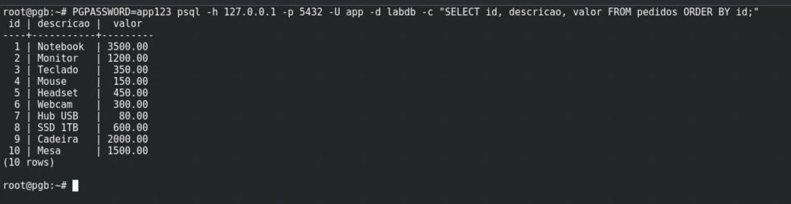
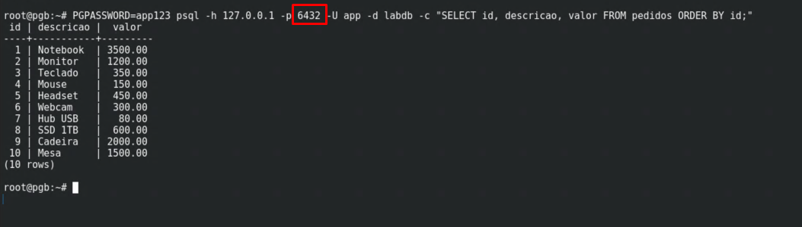
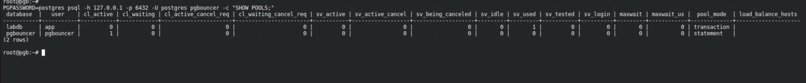
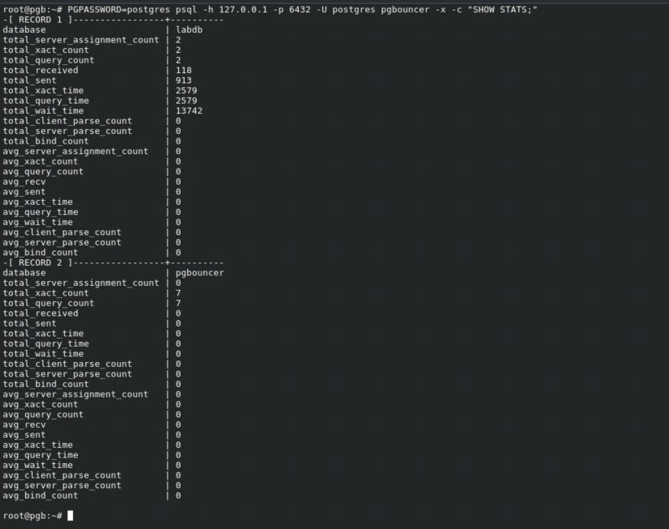
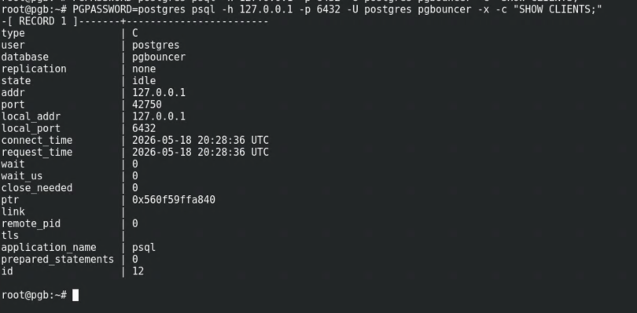
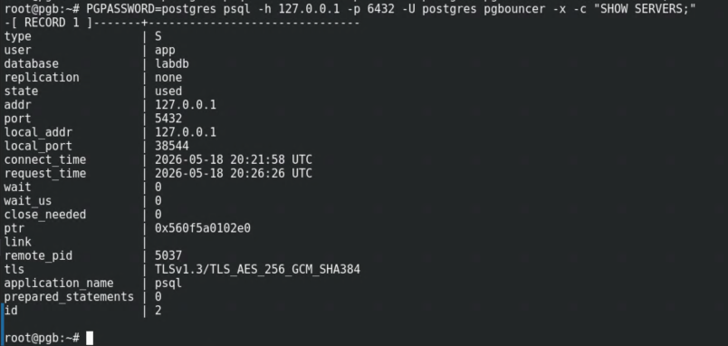
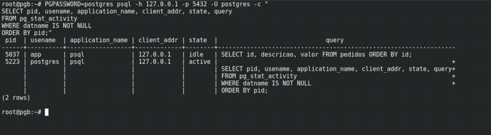
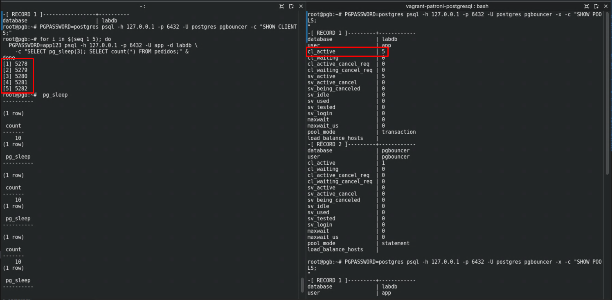
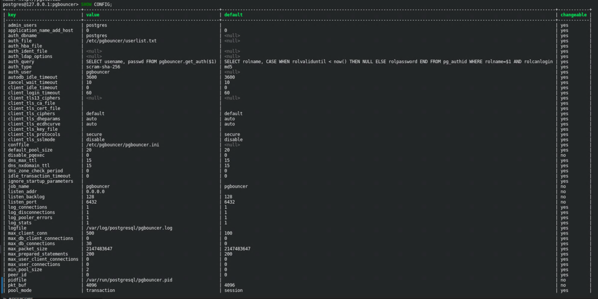

# PGBouncer

## O que é

PGBouncer é um **connection pooler** para PostgreSQL. Ele fica entre a aplicação e o banco de dados, recebendo as conexões da aplicação e reutilizando um conjunto menor de conexões reais com o PostgreSQL.

O PostgreSQL cria um processo separado no sistema operacional para cada conexão ativa. Em cenários com muitas conexões simultâneas, isso gera overhead expressivo de memória e CPU, mesmo quando as conexões estão ociosas. O PGBouncer resolve esse problema mantendo poucas conexões reais abertas e multiplexando as requisições da aplicação entre elas.

- [Documentação oficial](https://www.pgbouncer.org/)
- [GitHub](https://github.com/pgbouncer/pgbouncer)

> Os prints exibidos neste documento foram gerados em ambiente de laboratório local. Usuários, senhas e configurações mostrados nas imagens são apenas ilustrativos e não devem ser replicados em produção.

---

## Modos de operação

| Modo | Comportamento | Quando usar |
|---|---|---|
| **Session** | A conexão real fica alocada para o cliente durante toda a sessão | Aplicações que usam recursos de sessão (prepared statements, advisory locks, `SET LOCAL`) |
| **Transaction** | A conexão real é alocada apenas durante a transação e devolvida ao pool ao finalizar | Maioria dos casos. Melhor aproveitamento do pool |
| **Statement** | A conexão é devolvida após cada comando individual | Raramente usado. Incompatível com transações multi-statement |

O modo **transaction** é o mais eficiente para aplicações OLTP convencionais e é o recomendado na maioria dos casos.

> **Relatórios e queries longas em transaction mode**
>
> Em transaction mode, o PGBouncer pode encerrar queries longas se os parâmetros `query_timeout` ou `transaction_timeout` estiverem configurados com um valor baixo. Isso afeta especialmente relatórios que levam vários segundos ou minutos para retornar.
>
> Os parâmetros relevantes no `pgbouncer.ini`:
>
> - `query_timeout`: cancela qualquer query que ultrapasse esse tempo em segundos. O padrão é `0` (sem limite). Se estiver definido, queries de relatório demoradas serão derrubadas.
> - `transaction_timeout`: cancela a transação inteira se ultrapassar o tempo. Disponível a partir do PGBouncer 1.21. Padrão `0` (sem limite).
>
> Além dos timeouts, o mode transaction tem outras limitações que afetam relatórios:
>
> - **`SET` de sessão não persiste**: variáveis definidas com `SET work_mem = '1GB'` valem apenas para a transação atual. Na próxima transação, o PGBouncer pode entregar uma conexão diferente, sem essa configuração.
> - **Prepared statements**: não são suportados por padrão em transaction mode. A partir do PGBouncer 1.22, o parâmetro `max_prepared_statements` permite habilitar suporte limitado. Antes disso, a solução é desativar prepared statements no driver da aplicação.
>
> Para workloads analíticos ou de relatórios, considere usar o modo **session** em uma instância separada do PGBouncer (ou numa porta separada), mantendo o transaction mode para a aplicação OLTP. Assim o pool de relatórios tem timeouts maiores e suporte completo a sessão, sem prejudicar o throughput da aplicação principal.

---

## Por que o connection pooling é necessário

Sem pooling, cada conexão da aplicação cria um processo PostgreSQL. O custo fixo por conexão é de aproximadamente **10 MB de RAM** só de overhead do processo, independente de estar executando queries ou não.

Com pooling, a aplicação abre milhares de conexões no PGBouncer, mas o PostgreSQL vê apenas as conexões do pool. O fator de compartilhamento típico em transaction mode é de **20 conexões de aplicação para 1 conexão real**.

---

## Cálculo de dimensionamento

### O impacto das conexões na memória

Cada conexão no PostgreSQL cria um processo separado no sistema operacional. Esse processo consome aproximadamente **10 MB de RAM** só pelo fato de existir, independente de estar executando uma query ou parado esperando.

Isso significa que **4.000 conexões abertas ao mesmo tempo podem consumir até 40 GB de RAM apenas em overhead de processo**, sem contar os dados em memória, cache do sistema ou qualquer outro recurso do servidor.

Na prática, um servidor que precisa suportar 4.000 conexões diretas precisaria de **64 GB a 128 GB de RAM**, dependendo do que mais estiver rodando nele (queries pesadas, dados em cache, outros serviços).

---

### Conexão real vs conexão de mentira

É aqui que o PGBouncer entra. Ele separa dois conceitos que sem pooling são a mesma coisa:

**Conexão de mentira (lado da aplicação):** a aplicação abre uma conexão no PGBouncer achando que está falando diretamente com o banco. O PGBouncer aceita essa conexão, mas não necessariamente abre uma conexão real no PostgreSQL para ela.

**Conexão real (lado do banco):** são as conexões que o PGBouncer de fato mantém abertas no PostgreSQL. Esse número é muito menor, porque em transaction mode o PGBouncer empresta uma conexão real para a aplicação apenas enquanto ela está dentro de uma transação. Quando termina, devolve ao pool e outro pode usar.

```
Aplicação                 PGBouncer              PostgreSQL
─────────────────────────────────────────────────────────────
conexão 1  ─┐
conexão 2  ─┤
conexão 3  ─┤──► pool de 20 conexões reais ──► 20 processos
conexão 4  ─┤
...         │
conexão 4000─┘
```

Com 4.000 conexões de aplicação e um fator 1:20, o pool resulta em 200 conexões reais. O PostgreSQL vê apenas 200 processos, e o consumo cai de ~40 GB para ~2 GB só em overhead de conexão.

### Fator de compartilhamento

O ponto de partida para definir o tamanho do pool é o **fator de compartilhamento 1:20**: para cada conexão real aberta no PostgreSQL, o PGBouncer consegue atender aproximadamente 20 conexões de aplicação em transaction mode.

```
Conexões de aplicação: 4.000
Fator de compartilhamento: 1:20
─────────────────────────────────────────
Conexões reais no PostgreSQL: 4.000 ÷ 20 = 200
```

> Este é um valor aproximado e bem estimado, não uma regra exata. O fator real depende do perfil da aplicação: quanto mais curtas e rápidas forem as transações, mais conexões de aplicação uma única conexão real consegue atender. Em aplicações com transações longas ou que mantêm sessão aberta por muito tempo, o fator cai. O valor 1:20 é um ponto de partida seguro para a maioria dos cenários OLTP.

---

## Instalação

**Debian/Ubuntu:**

```bash
apt-get install -y pgbouncer
```

**RHEL/Rocky/AlmaLinux:**

```bash
dnf install -y pgbouncer
```

---

## Configuração

Os dois arquivos principais são `/etc/pgbouncer/pgbouncer.ini` e `/etc/pgbouncer/userlist.txt`.

### pgbouncer.ini

```ini
[databases]
; Define os bancos que o PGBouncer expõe
; nome_exposto = host=<ip_postgres> port=5432 dbname=<banco_real>
producao = host=127.0.0.1 port=5432 dbname=producao
; auth_dbname precisa estar listado aqui para o auth_query funcionar
postgres = host=127.0.0.1 port=5432 dbname=postgres

[pgbouncer]
; Onde o PGBouncer escuta
listen_addr = 0.0.0.0
listen_port = 6432

; Modo de operação
pool_mode = transaction

; Conexões máximas recebidas do lado da aplicação
max_client_conn = 5000

; Conexões reais abertas por banco+usuário (resultado do cálculo acima)
default_pool_size = 300

; Conexões de reserva para suprir picos momentâneos
reserve_pool_size = 50

; Tempo (s) antes de usar o reserve_pool quando o pool normal está cheio
reserve_pool_timeout = 3

; Conexões mínimas mantidas abertas mesmo sem demanda
min_pool_size = 10

; Máximo de conexões por banco somando todos os usuários
max_db_connections = 350

; Autenticação
auth_type    = scram-sha-256
auth_file    = /etc/pgbouncer/userlist.txt
auth_user    = pgbouncer
auth_dbname  = postgres
auth_query   = SELECT usename, passwd FROM pgbouncer.get_auth($1)

; Logging
logfile  = /var/log/postgresql/pgbouncer.log
pidfile  = /var/run/postgresql/pgbouncer.pid

; Estatísticas e administração
admin_users  = postgres
stats_users  = postgres

; Timeouts (segundos)
server_idle_timeout   = 600   ; fecha conexão ociosa após 10 min
client_idle_timeout   = 0     ; 0 = sem limite para o lado cliente
query_timeout         = 0     ; 0 = sem limite por query
server_connect_timeout = 15   ; tempo máximo para abrir conexão no PG
```

### Usuário dedicado para autenticação (recomendado)

A abordagem recomendada pela documentação oficial é criar um usuário dedicado `pgbouncer` no PostgreSQL. Em vez de armazenar hashes estáticos no `userlist.txt`, o PGBouncer usa esse usuário para consultar dinamicamente as credenciais no banco via `auth_query`. Assim, novos usuários ou trocas de senha no PostgreSQL refletem automaticamente no PGBouncer, sem precisar atualizar arquivos.

O usuário `pgbouncer` não precisa de acesso às tabelas da aplicação. Ele só precisa executar a função de autenticação.

**1. Criar o schema, o usuário e a função no PostgreSQL:**

```sql
-- Schema isolado para os objetos do pgbouncer
CREATE SCHEMA pgbouncer;

-- Usuário dedicado (sem acesso a dados da aplicação)
CREATE USER pgbouncer WITH LOGIN PASSWORD 'senha_segura';

-- Função SECURITY DEFINER: executa com privilégios do owner (superusuário),
-- permitindo que o usuário pgbouncer leia pg_shadow sem ser superusuário
CREATE OR REPLACE FUNCTION pgbouncer.get_auth(p_usename TEXT)
RETURNS TABLE(usename TEXT, passwd TEXT)
LANGUAGE sql SECURITY DEFINER AS $$
    SELECT usename::TEXT, passwd::TEXT
    FROM pg_shadow
    WHERE usename = p_usename;
$$;

GRANT EXECUTE ON FUNCTION pgbouncer.get_auth TO pgbouncer;
```

**2. No `userlist.txt`, coloque o hash SCRAM do usuário `pgbouncer` extraído do `pg_shadow`:**

O PGBouncer 1.21+ com `auth_type = scram-sha-256` exige SCRAM verifiers no `userlist.txt`, não plain passwords. Os outros usuários da aplicação são resolvidos dinamicamente via `auth_query` e não precisam estar no arquivo.

```sql
-- Gerar a linha pronta para colar no userlist.txt
SELECT '"pgbouncer" "' || passwd || '"'
FROM pg_shadow
WHERE usename = 'pgbouncer';
```

```
"pgbouncer" "SCRAM-SHA-256$4096:..."
```

**3. No `pgbouncer.ini`, configure:**

> `auth_dbname` precisa estar listado na seção `[databases]`: o PGBouncer não acessa bancos que não estejam explicitamente configurados ali.

```ini
[databases]
producao = host=127.0.0.1 port=5432 dbname=producao
postgres = host=127.0.0.1 port=5432 dbname=postgres

[pgbouncer]
auth_type    = scram-sha-256
auth_file    = /etc/pgbouncer/userlist.txt
auth_user    = pgbouncer
auth_dbname  = postgres
auth_query   = SELECT usename, passwd FROM pgbouncer.get_auth($1)
```

**Como funciona:**

```
Aplicação conecta com user/senha
  → PGBouncer inicia handshake SCRAM com o cliente
  → PGBouncer conecta no banco 'postgres' como 'pgbouncer' (auth_dbname)
  → executa get_auth('nome_do_usuario') → retorna SCRAM verifier
  → PGBouncer valida a senha do cliente contra o verifier
  → autenticação concluída, conexão autorizada ao pool
```

Recarregar sem reiniciar:

```bash
kill -HUP $(cat /var/run/postgresql/pgbouncer.pid)
# ou
psql -h 127.0.0.1 -p 6432 -U postgres pgbouncer -c "RELOAD;"
```

---

## Parâmetros principais

| Parâmetro | O que controla |
|---|---|
| `pool_mode` | Modo de operação: `session`, `transaction` ou `statement` |
| `max_client_conn` | Limite total de conexões recebidas da aplicação |
| `default_pool_size` | Conexões reais abertas por combinação banco+usuário |
| `reserve_pool_size` | Conexões extras para absorver picos |
| `min_pool_size` | Conexões mantidas abertas mesmo sem carga (evita latência no cold start) |
| `max_db_connections` | Teto absoluto de conexões reais por banco, independente do usuário |
| `server_idle_timeout` | Tempo até fechar uma conexão ociosa do lado do PostgreSQL |
| `auth_type` | Método de autenticação entre PGBouncer e a aplicação |
| `auth_user` | Usuário dedicado que o PGBouncer usa para executar `auth_query` no PostgreSQL |
| `auth_dbname` | Banco onde a `auth_query` é executada. Sem isso, roda no banco do cliente, que pode não ter a função |
| `auth_query` | Query que retorna o hash da senha dado um nome de usuário |

---

## Serviço systemd

```bash
systemctl enable pgbouncer
systemctl start pgbouncer
systemctl status pgbouncer
```

---

## Monitoramento

Conecte no banco administrativo do PGBouncer na porta configurada:

```bash
psql -h 127.0.0.1 -p 6432 -U postgres pgbouncer
```

### Conexão direta vs via PGBouncer

Mesma query, mesmo resultado: a diferença está na porta. Na porta `5432` a conexão vai direto ao PostgreSQL. Na porta `6432` passa pelo pool.





---

### SHOW POOLS

Visão geral dos pools ativos. O banco `labdb` aparece em `transaction` mode: cada conexão de aplicação usa uma conexão real apenas durante a transação e a devolve ao pool ao finalizar.

```sql
SHOW POOLS;
```

| Coluna | O que mostra |
|---|---|
| `cl_active` | Conexões de aplicação com query em andamento |
| `cl_waiting` | Conexões de aplicação aguardando conexão real disponível |
| `sv_active` | Conexões reais em uso |
| `sv_idle` | Conexões reais abertas e disponíveis no pool |
| `sv_used` | Conexões reais recém liberadas, não ainda em idle |



**Sinal de que o pool está subdimensionado:** se `cl_waiting` for maior que zero de forma recorrente, o `default_pool_size` está abaixo da demanda real.

---

### SHOW STATS

Estatísticas de requisições, volume de dados e latência por banco. Use `-x` no psql para expanded display: a saída tem muitas colunas.

```sql
SHOW STATS;
```



---

### SHOW CLIENTS

Conexões abertas do lado da aplicação: o que o PGBouncer vê chegando.

```sql
SHOW CLIENTS;
```



---

### SHOW SERVERS

Conexões reais abertas pelo PGBouncer no PostgreSQL. Aqui fica evidente que o número de conexões no PostgreSQL é menor do que as abertas pela aplicação. O campo `tls` confirma que a conexão entre PGBouncer e PostgreSQL usa TLS.

```sql
SHOW SERVERS;
```



---

### pg_stat_activity: o que o PostgreSQL enxerga

Conectado diretamente no PostgreSQL, a `pg_stat_activity` mostra apenas as conexões do pool: não as da aplicação. O PGBouncer é transparente para o banco.

```sql
SELECT pid, usename, application_name, client_addr, state, query
FROM pg_stat_activity
WHERE datname IS NOT NULL
ORDER BY pid;
```



---

### Pool em ação: 5 conexões simultâneas

Com 5 conexões abertas ao mesmo tempo via PGBouncer, o PostgreSQL vê apenas as conexões reais do pool. O `SHOW POOLS` mostra `cl_active` com os clientes ativos e `sv_active` com as conexões reais que estão sendo usadas no momento.



---

### SHOW CONFIG

Configuração ativa do PGBouncer carregada em memória. Útil para confirmar os parâmetros sem abrir o arquivo `pgbouncer.ini`.

```sql
SHOW CONFIG;
```



---

## Referência rápida

| Ação | Comando |
|---|---|
| Recarregar configuração | `RELOAD;` no pgbouncer ou `kill -HUP <pid>` |
| Ver pools | `SHOW POOLS;` |
| Ver estatísticas | `SHOW STATS;` |
| Ver configuração | `SHOW CONFIG;` |
| Pausar um banco | `PAUSE producao;` |
| Retomar um banco | `RESUME producao;` |
| Desconectar todos | `KILL producao;` |
| Encerrar o processo | `SHUTDOWN;` |
