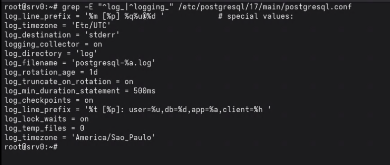
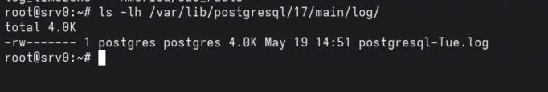
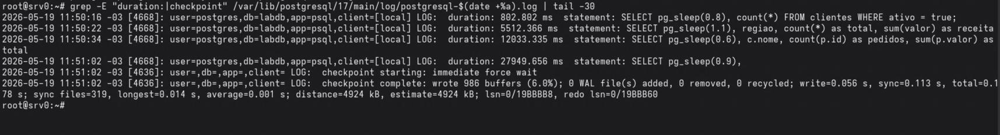
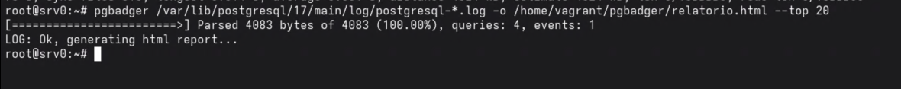
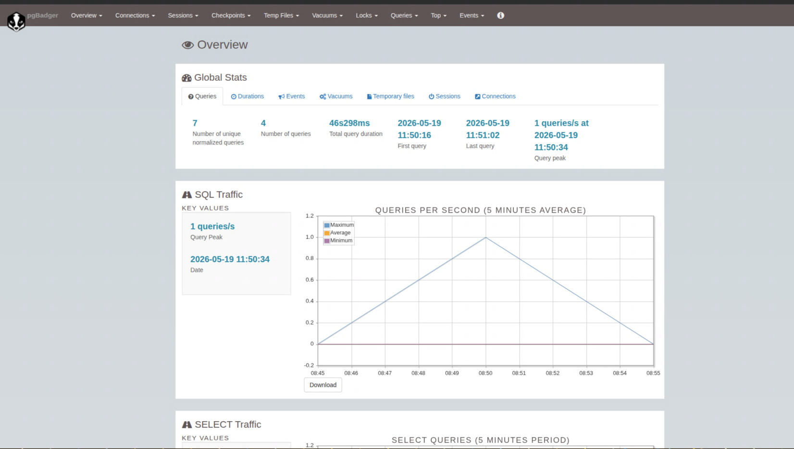
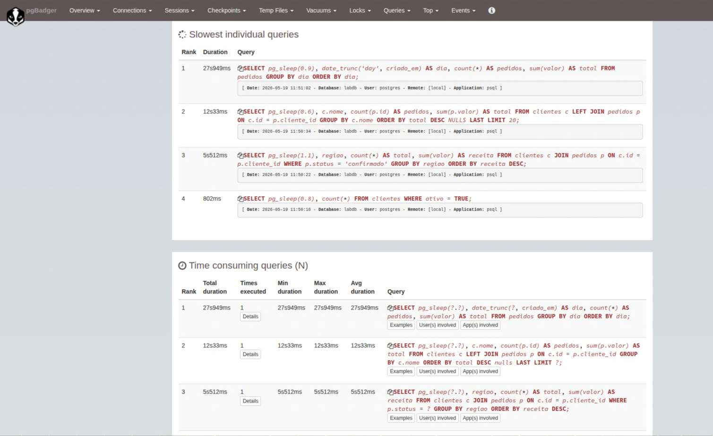
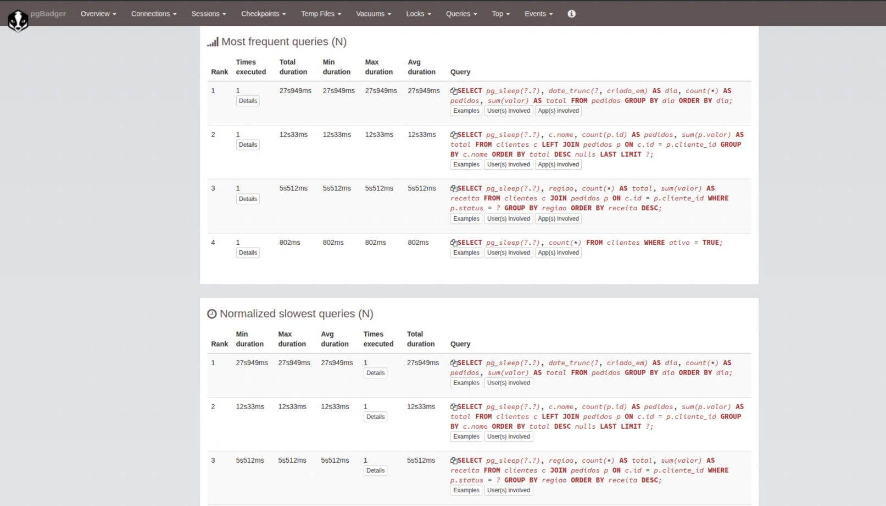
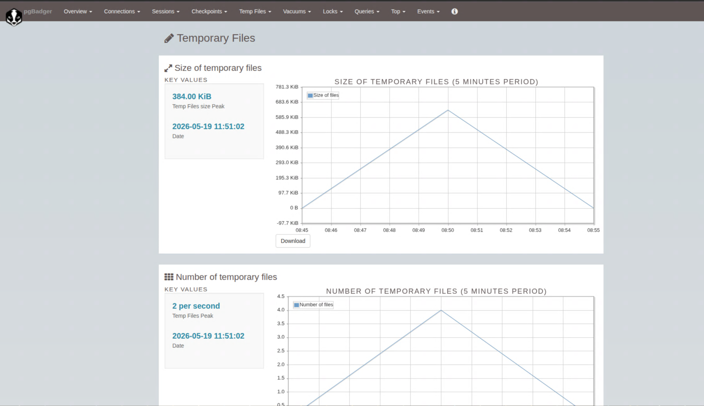
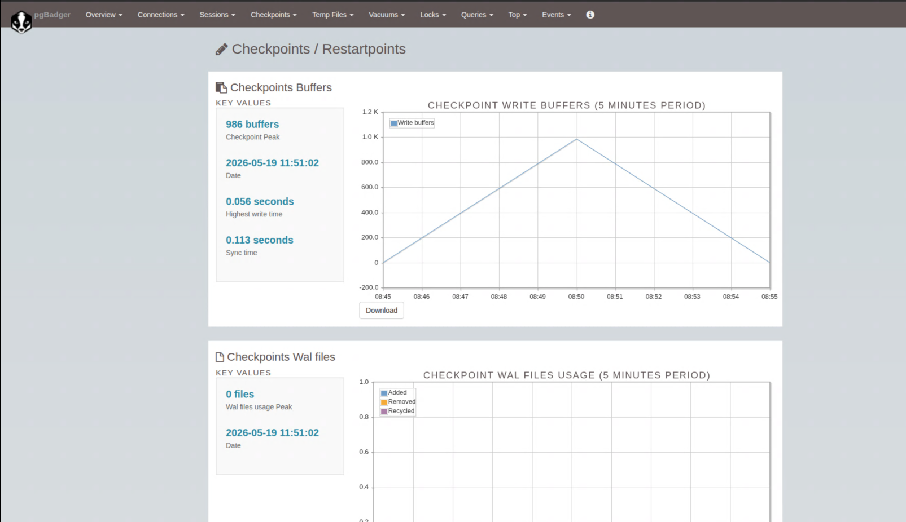

# Análise de Logs com o PGBadger

O PGBadger é um analisador de logs do PostgreSQL que gera relatórios HTML detalhados sobre o comportamento do banco de dados: queries lentas, erros, locks, conexões, checkpoints, uso por aplicação e muito mais.

Ele lê os arquivos de log gerados pelo PostgreSQL e produz um relatório estático em HTML, sem necessidade de agente ou conexão com o banco.

> Os prints exibidos neste documento foram gerados em ambiente de laboratório local. Usuários, senhas e configurações mostrados nas imagens são apenas ilustrativos e não devem ser replicados em produção.


## Instalação

**Debian:**
```bash
apt-get install -y pgbadger
```

**RHEL:**
```bash
dnf install -y pgbadger
```

Verificar a versão instalada:
```bash
pgbadger --version
```


## Configuração de Log no PostgreSQL

Para que o PGBadger consiga analisar os logs, o PostgreSQL precisa estar configurado para registrar as informações necessárias. As configurações abaixo devem ser adicionadas ao `postgresql.conf`:

```
log_destination = 'stderr'
logging_collector = on
log_directory = 'log'
log_filename = 'postgresql-%a.log'
log_rotation_age = 1d
log_truncate_on_rotation = on
log_min_duration_statement = 10s
log_checkpoints = on
log_line_prefix = '%t [%p]: user=%u,db=%d,app=%a,client=%h '
log_lock_waits = on
log_temp_files = 0
log_timezone = 'America/Sao_Paulo'
```

O caminho do `postgresql.conf` difere entre distribuições:

| Distribuição | postgresql.conf |
|---|---|
| Debian | `/etc/postgresql/17/main/postgresql.conf` |
| RHEL | `/var/lib/pgsql/17/data/postgresql.conf` |



Após alterar o `postgresql.conf`, recarregue as configurações:

**Debian:**
```bash
pg_ctlcluster 17 main reload
```

**RHEL:**
```bash
/usr/pgsql-17/bin/pg_ctl reload -D /var/lib/pgsql/17/data
```


## Descrição das Configurações de Log

| Parâmetro | Valor | Descrição |
|---|---|---|
| `log_destination` | `stderr` | Saída dos logs para o coletor padrão |
| `logging_collector` | `on` | Habilita o coletor de logs do PostgreSQL |
| `log_directory` | `log` | Diretório onde os arquivos de log são criados (relativo ao PGDATA) |
| `log_filename` | `postgresql-%a.log` | Nome do arquivo por dia da semana (Mon, Tue... Sun), criando 7 arquivos rotativos |
| `log_rotation_age` | `1d` | Rotaciona o arquivo a cada 1 dia |
| `log_truncate_on_rotation` | `on` | Trunca o arquivo ao rotacionar, sobrescrevendo o do mesmo dia da semana anterior |
| `log_min_duration_statement` | `10s` | Registra queries que demorem mais de 10 segundos |
| `log_checkpoints` | `on` | Registra informações de checkpoint |
| `log_line_prefix` | `'%t [%p]: user=%u,db=%d,app=%a,client=%h '` | Prefixo de cada linha de log |
| `log_lock_waits` | `on` | Registra esperas por lock que excedam `deadlock_timeout` |
| `log_temp_files` | `0` | Registra todos os arquivos temporários criados (0 registra todos) |
| `log_timezone` | `America/Sao_Paulo` | Fuso horário usado nos timestamps do log |


### Variáveis disponíveis no log_line_prefix

| Variável | Descrição |
|---|---|
| `%t` | Timestamp sem milissegundos |
| `%m` | Timestamp com milissegundos |
| `%p` | PID do processo |
| `%u` | Nome do usuário |
| `%d` | Nome do banco de dados |
| `%a` | Nome da aplicação |
| `%h` | Host remoto |
| `%r` | Host remoto e porta |
| `%c` | ID da sessão |
| `%l` | Número de linha da sessão |
| `%s` | Timestamp de início da sessão |
| `%i` | Tag do comando (SELECT, INSERT etc.) |
| `%e` | Código SQL State |
| `%x` | ID da transação (0 se não houver) |
| `%q` | Para aqui em processos que não são sessões |


## Localização dos Arquivos de Log

Os arquivos de log ficam dentro do diretório PGDATA, na subpasta `log/`:

| Distribuição | Caminho dos logs |
|---|---|
| Debian | `/var/lib/postgresql/17/main/log/` |
| RHEL | `/var/lib/pgsql/17/data/log/` |



Com a configuração `log_filename = 'postgresql-%a.log'`, os arquivos gerados são:

```
postgresql-Mon.log
postgresql-Tue.log
postgresql-Wed.log
postgresql-Thu.log
postgresql-Fri.log
postgresql-Sat.log
postgresql-Sun.log
```


## Gerando o Relatório



Gerar relatório a partir de um único arquivo de log:

```bash
pgbadger /var/lib/postgresql/17/main/log/postgresql-Mon.log -o relatorio.html
```

Gerar relatório consolidando todos os arquivos de log:

```bash
pgbadger /var/lib/postgresql/17/main/log/postgresql-*.log -o relatorio.html
```



Abrir o relatório no navegador:

```bash
xdg-open relatorio.html
```


## Opções Comuns

| Opção | Descrição |
|---|---|
| `-o arquivo.html` | Arquivo de saída do relatório |
| `-f stderr` | Formato do log: `stderr`, `syslog`, `csvlog`, `jsonlog` |
| `--top N` | Exibe as top N queries em cada seção (padrão: 20) |
| `-b "DATA"` | Analisar logs a partir de uma data (`2026-05-19 00:00:00`) |
| `-e "DATA"` | Analisar logs até uma data |
| `-d BANCO` | Filtrar por banco de dados |
| `-u USUARIO` | Filtrar por usuário |
| `-a APLICACAO` | Filtrar por nome de aplicação |
| `--quiet` | Sem saída no terminal durante o processamento |
| `-j N` | Número de processos paralelos para análise (padrão: 1) |
| `--outdir DIR` | Diretório de saída para o relatório |

Exemplo com filtros:

```bash
pgbadger /var/lib/postgresql/17/main/log/postgresql-*.log \
    -o relatorio.html \
    --top 30 \
    -b "2026-05-19 00:00:00" \
    -e "2026-05-19 23:59:59"
```


## Agendamento com Cron

Para gerar um relatório diário automaticamente, o cron deve analisar apenas o log de **ontem**, não todos os arquivos. Como o `log_filename = 'postgresql-%a.log'` rotaciona por dia da semana, usamos `date -d yesterday +%a` para obter o nome do dia anterior:

```bash
crontab -e
0 6 * * * pgbadger /var/lib/postgresql/17/main/log/postgresql-$(date -d yesterday +%a).log -o /var/www/html/pgbadger/relatorio.html --quiet
```

O relatório será gerado todos os dias às 6:00 da manhã com os dados do dia anterior completo.

> Usar `*.log` no lugar de `$(date -d yesterday +%a).log` faria o pgbadger analisar os 7 arquivos rotativos a cada execução, misturando dados de dias diferentes no mesmo relatório.


## O que o Relatório Exibe

O relatório HTML gerado pelo PGBadger inclui:











- **Queries lentas:** as queries que mais demoraram, ordenadas por tempo total e por tempo médio
- **Queries mais frequentes:** as queries executadas com maior frequência
- **Erros e warnings:** lista de erros registrados com frequência e contexto
- **Conexões:** número de conexões por hora, por aplicação e por usuário
- **Locks:** eventos de espera por lock
- **Checkpoints:** frequência e duração dos checkpoints
- **Arquivos temporários:** queries que geraram arquivos temporários em disco
- **Sessões:** duração e distribuição das sessões
- **Estatísticas por banco e por usuário:** visão geral de atividade segmentada
- **Conexões:** número de conexões por hora, por aplicação e por usuário (requer `log_connections = on` e `log_disconnections = on`)
