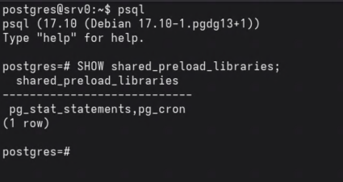
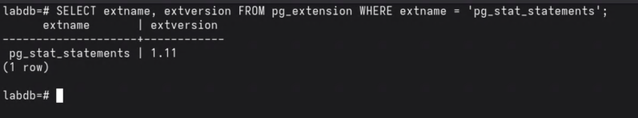
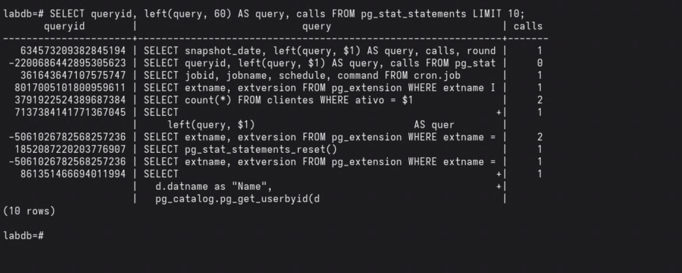
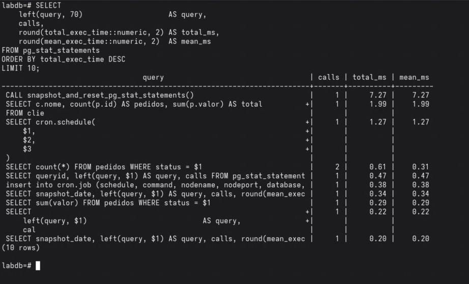
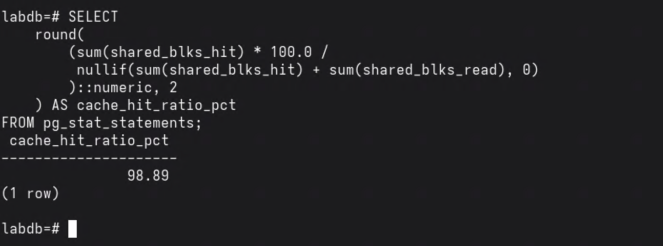
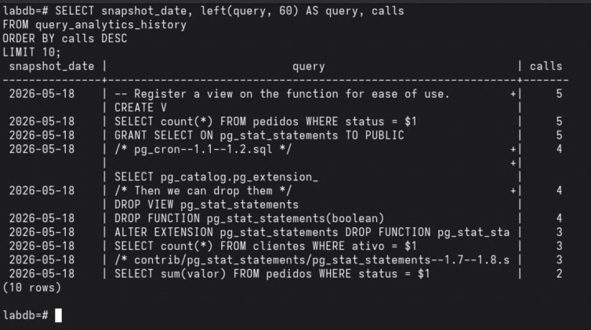
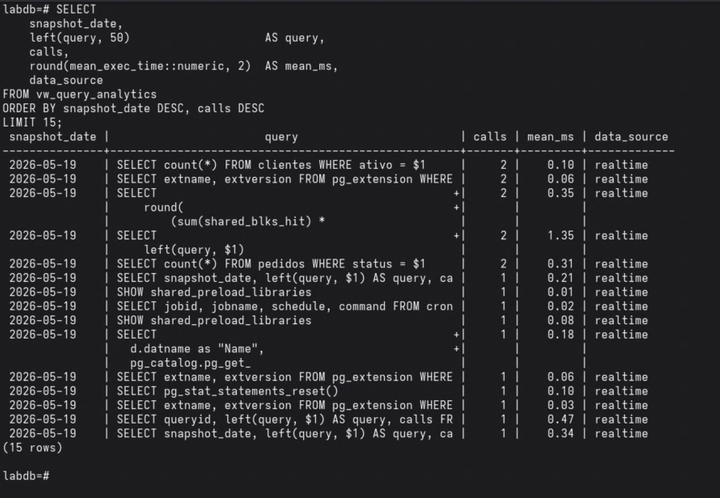
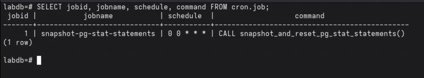

# pg_stat_statements

O pg_stat_statements é uma extensão oficial do PostgreSQL que rastreia estatísticas de execução de todas as queries SQL processadas pelo servidor. Para cada query única (normalizada, sem os valores literais), a extensão acumula métricas como número de chamadas, tempo de execução, leituras de cache e disco, linhas afetadas, WAL gerado e muito mais.

Essas métricas ficam disponíveis na view `pg_stat_statements` e são a principal ferramenta para identificar queries lentas, alto consumo de I/O e tendências de performance ao longo do tempo.

> Esta documentação foi elaborada com base no PostgreSQL 17.

> Os prints exibidos neste documento foram gerados em ambiente de laboratório local. Usuários, senhas e configurações mostrados nas imagens são apenas ilustrativos e não devem ser replicados em produção.


## Instalação

A extensão é distribuída junto com o PostgreSQL e não requer pacote adicional. É necessário habilitá-la no `postgresql.conf` e criar a extensão no banco.


### 1. Configurar o postgresql.conf

```
shared_preload_libraries = 'pg_stat_statements'
pg_stat_statements.max            = 10000
pg_stat_statements.track          = all
pg_stat_statements.track_planning = on
```

> Se `shared_preload_libraries` já tiver outros valores, adicionar `pg_stat_statements` separado por vírgula: `'pg_cron,pg_stat_statements'`

| Distribuição | postgresql.conf |
|---|---|
| Debian | `/etc/postgresql/17/main/postgresql.conf` |
| RHEL | `/var/lib/pgsql/17/data/postgresql.conf` |



Após alterar, reiniciar o PostgreSQL:

```bash
systemctl restart postgresql
```


### 2. Criar a extensão no banco

Conectar ao banco desejado e executar:

```sql
CREATE EXTENSION IF NOT EXISTS pg_stat_statements;
```

> A extensão precisa ser criada separadamente em cada banco que se deseja monitorar.

Confirmar a criação:

```sql
SELECT extname, extversion FROM pg_extension WHERE extname = 'pg_stat_statements';
```




## Parâmetros de configuração

| Parâmetro | Padrão | Descrição |
|---|---|---|
| `pg_stat_statements.max` | 5000 | Número máximo de queries rastreadas. Quando atingido, as menos usadas são descartadas |
| `pg_stat_statements.track` | `top` | Quais queries rastrear: `top` (somente diretas), `all` (inclui chamadas dentro de funções), `none` |
| `pg_stat_statements.track_planning` | `off` | Rastrear tempo gasto no planejamento das queries |
| `pg_stat_statements.track_utility` | `on` | Rastrear comandos utilitários (VACUUM, CREATE TABLE, etc.) |
| `pg_stat_statements.save` | `on` | Persistir estatísticas entre reinicializações do servidor |


## A view pg_stat_statements

A view expõe uma linha por combinação única de query, banco de dados e usuário. O texto da query é normalizado: os valores literais são substituídos por `$1`, `$2`, etc., fazendo com que `WHERE id = 1` e `WHERE id = 2` sejam tratados como a mesma query.




### Principais colunas

| Coluna | Tipo | Descrição |
|---|---|---|
| `queryid` | bigint | Hash único da query normalizada |
| `query` | text | Texto normalizado da query |
| `calls` | bigint | Total de execuções desde o último reset |
| `total_exec_time` | double | Tempo total de execução acumulado (ms) |
| `mean_exec_time` | double | Tempo médio de execução (ms) |
| `min_exec_time` | double | Tempo mínimo registrado (ms) |
| `max_exec_time` | double | Tempo máximo registrado (ms) |
| `rows` | bigint | Total de linhas retornadas ou afetadas |
| `shared_blks_hit` | bigint | Blocos lidos do buffer pool (cache) |
| `shared_blks_read` | bigint | Blocos lidos do disco |
| `plans` | bigint | Vezes que a query foi planejada (requer `track_planning = on`) |
| `total_plan_time` | double | Tempo total gasto no planejamento (ms) |
| `wal_bytes` | numeric | Bytes de WAL gerados pela query |


## Queries úteis

### Top 10 queries por tempo total

```sql
SELECT
    queryid,
    left(query, 80)                           AS query,
    calls,
    round(total_exec_time::numeric, 2)        AS total_ms,
    round(mean_exec_time::numeric, 2)         AS mean_ms
FROM pg_stat_statements
ORDER BY total_exec_time DESC
LIMIT 10;
```




### Top 10 queries por leitura de disco

```sql
SELECT
    queryid,
    left(query, 80)   AS query,
    calls,
    shared_blks_read  AS blks_disco,
    shared_blks_hit   AS blks_cache
FROM pg_stat_statements
ORDER BY shared_blks_read DESC
LIMIT 10;
```


### Cache hit ratio global

Indica a proporção de leituras atendidas pelo cache em relação ao total de leituras. Valores abaixo de 95% merecem investigação.

```sql
SELECT
    round(
        (sum(shared_blks_hit) * 100.0 /
         nullif(sum(shared_blks_hit) + sum(shared_blks_read), 0)
        )::numeric, 2
    ) AS cache_hit_ratio_pct
FROM pg_stat_statements;
```




### Queries com alto tempo de planejamento

```sql
SELECT
    queryid,
    left(query, 80)                     AS query,
    plans,
    round(total_plan_time::numeric, 2)  AS total_plan_ms,
    round(mean_plan_time::numeric, 2)   AS mean_plan_ms
FROM pg_stat_statements
WHERE plans > 0
ORDER BY total_plan_time DESC
LIMIT 10;
```


### Resetar as estatísticas

```sql
SELECT pg_stat_statements_reset();
```

> Resets apagam todo o histórico acumulado. O sistema Query Analytics descrito abaixo resolve esse problema capturando snapshots antes de cada reset.


## Query Analytics

O pg_stat_statements acumula estatísticas desde o último reset. Dois problemas surgem na prática:

1. **Sem reset:** os dados acumulam indefinidamente, misturando períodos distintos e dificultando análises por dia.
2. **Com reset frequente:** o histórico é perdido, impedindo comparações entre dias.

Para resolver isso, desenvolvi o sistema Query Analytics: um ciclo diário que captura um snapshot dos dados antes do reset, mantém 14 dias de histórico em tabela própria e expõe tudo por uma view unificada. A view combina os dados históricos com os dados realtime do pg_stat_statements, permitindo consultas que atravessam vários dias sem perceber a troca de fonte.


### Fluxo

```
Grafana consulta vw_query_analytics
        │
        ├── snapshot_date = hoje  ──► pg_stat_statements (realtime)
        │
        └── snapshot_date < hoje  ──► query_analytics_history (fechado)

Meia-noite: pg_cron
        ├── INSERT INTO query_analytics_history (CURRENT_DATE - 1)
        ├── DELETE registros com mais de 14 dias
        └── pg_stat_statements_reset()
```


### 1. Tabela de histórico

Armazena um snapshot diário de todas as colunas do pg_stat_statements mais a coluna `cache_hit_ratio` já calculada. A constraint `UNIQUE (snapshot_date, queryid, dbid, userid)` garante idempotência: executar o snapshot duas vezes no mesmo dia não duplica dados.

```sql
CREATE TABLE query_analytics_history (
    id                        BIGSERIAL PRIMARY KEY,
    snapshot_date             DATE        NOT NULL,
    userid                    OID,
    dbid                      OID,
    toplevel                  BOOLEAN,
    queryid                   BIGINT,
    query                     TEXT,
    plans                     BIGINT,
    total_plan_time           DOUBLE PRECISION,
    min_plan_time             DOUBLE PRECISION,
    max_plan_time             DOUBLE PRECISION,
    mean_plan_time            DOUBLE PRECISION,
    stddev_plan_time          DOUBLE PRECISION,
    calls                     BIGINT,
    total_exec_time           DOUBLE PRECISION,
    min_exec_time             DOUBLE PRECISION,
    max_exec_time             DOUBLE PRECISION,
    mean_exec_time            DOUBLE PRECISION,
    stddev_exec_time          DOUBLE PRECISION,
    rows                      BIGINT,
    shared_blks_hit           BIGINT,
    shared_blks_read          BIGINT,
    shared_blks_dirtied       BIGINT,
    shared_blks_written       BIGINT,
    local_blks_hit            BIGINT,
    local_blks_read           BIGINT,
    local_blks_dirtied        BIGINT,
    local_blks_written        BIGINT,
    temp_blks_read            BIGINT,
    temp_blks_written         BIGINT,
    shared_blk_read_time      DOUBLE PRECISION,
    shared_blk_write_time     DOUBLE PRECISION,
    local_blk_read_time       DOUBLE PRECISION,
    local_blk_write_time      DOUBLE PRECISION,
    temp_blk_read_time        DOUBLE PRECISION,
    temp_blk_write_time       DOUBLE PRECISION,
    wal_records               BIGINT,
    wal_fpi                   BIGINT,
    wal_bytes                 NUMERIC,
    jit_functions             BIGINT,
    jit_generation_time       DOUBLE PRECISION,
    jit_inlining_count        BIGINT,
    jit_inlining_time         DOUBLE PRECISION,
    jit_optimization_count    BIGINT,
    jit_optimization_time     DOUBLE PRECISION,
    jit_emission_count        BIGINT,
    jit_emission_time         DOUBLE PRECISION,
    jit_deform_count          BIGINT,
    jit_deform_time           DOUBLE PRECISION,
    stats_since               TIMESTAMPTZ,
    minmax_stats_since        TIMESTAMPTZ,
    cache_hit_ratio           NUMERIC(5,2),
    UNIQUE (snapshot_date, queryid, dbid, userid)
);

CREATE INDEX idx_qah_snapshot_date ON query_analytics_history (snapshot_date);
CREATE INDEX idx_qah_queryid       ON query_analytics_history (queryid);
CREATE INDEX idx_qah_dbid          ON query_analytics_history (dbid);
```




### 2. Procedure de snapshot e reset

Executada uma vez por dia pelo pg_cron. Grava os dados do pg_stat_statements na tabela de histórico com `snapshot_date = CURRENT_DATE - 1` (os dados pertencem ao dia que acabou de terminar, não ao dia atual), remove registros mais antigos que 14 dias e executa o reset.

```sql
CREATE OR REPLACE PROCEDURE public.snapshot_and_reset_pg_stat_statements()
LANGUAGE plpgsql
AS $procedure$
BEGIN
    INSERT INTO query_analytics_history (
        snapshot_date, userid, dbid, toplevel, queryid, query,
        plans, total_plan_time, min_plan_time, max_plan_time, mean_plan_time, stddev_plan_time,
        calls, total_exec_time, min_exec_time, max_exec_time, mean_exec_time, stddev_exec_time,
        rows, shared_blks_hit, shared_blks_read, shared_blks_dirtied, shared_blks_written,
        local_blks_hit, local_blks_read, local_blks_dirtied, local_blks_written,
        temp_blks_read, temp_blks_written,
        shared_blk_read_time, shared_blk_write_time,
        local_blk_read_time, local_blk_write_time,
        temp_blk_read_time, temp_blk_write_time,
        wal_records, wal_fpi, wal_bytes,
        jit_functions, jit_generation_time,
        jit_inlining_count, jit_inlining_time,
        jit_optimization_count, jit_optimization_time,
        jit_emission_count, jit_emission_time,
        jit_deform_count, jit_deform_time,
        stats_since, minmax_stats_since,
        cache_hit_ratio
    )
    SELECT
        CURRENT_DATE - 1,
        userid, dbid, toplevel, queryid, query,
        plans, total_plan_time, min_plan_time, max_plan_time, mean_plan_time, stddev_plan_time,
        calls, total_exec_time, min_exec_time, max_exec_time, mean_exec_time, stddev_exec_time,
        rows, shared_blks_hit, shared_blks_read, shared_blks_dirtied, shared_blks_written,
        local_blks_hit, local_blks_read, local_blks_dirtied, local_blks_written,
        temp_blks_read, temp_blks_written,
        shared_blk_read_time, shared_blk_write_time,
        local_blk_read_time, local_blk_write_time,
        temp_blk_read_time, temp_blk_write_time,
        wal_records, wal_fpi, wal_bytes,
        jit_functions, jit_generation_time,
        jit_inlining_count, jit_inlining_time,
        jit_optimization_count, jit_optimization_time,
        jit_emission_count, jit_emission_time,
        jit_deform_count, jit_deform_time,
        stats_since, minmax_stats_since,
        CASE
            WHEN (shared_blks_hit + shared_blks_read) > 0
            THEN ROUND((shared_blks_hit::NUMERIC / (shared_blks_hit + shared_blks_read)) * 100, 2)
            ELSE 100.00
        END
    FROM pg_stat_statements
    WHERE calls > 0
    ON CONFLICT (snapshot_date, queryid, dbid, userid) DO NOTHING;

    DELETE FROM query_analytics_history
    WHERE snapshot_date < CURRENT_DATE - 14;

    PERFORM pg_stat_statements_reset();

    RAISE NOTICE 'Snapshot de % gravado, histórico truncado para 14 dias e pg_stat_statements resetado.', CURRENT_DATE - 1;
END;
$procedure$;
```

Para executar manualmente fora do ciclo agendado:

```sql
CALL snapshot_and_reset_pg_stat_statements();
```


### 3. View unificada

A view `vw_query_analytics` unifica dois conjuntos de dados em uma única interface:

- **realtime:** lê diretamente do `pg_stat_statements` com `snapshot_date = CURRENT_DATE` e `data_source = 'realtime'`
- **history:** lê de `query_analytics_history` para `snapshot_date < CURRENT_DATE` com `data_source = 'history'`

Essa separação garante que o dado de hoje nunca sobrescreva o histórico e que qualquer ferramenta de visualização (Grafana, por exemplo) use uma única fonte para todos os dias.

```sql
CREATE OR REPLACE VIEW vw_query_analytics AS

    SELECT
        CURRENT_DATE                            AS snapshot_date,
        pss.userid,
        r.rolname                               AS username,
        pss.dbid,
        d.datname                               AS dbname,
        pss.toplevel, pss.queryid, pss.query,
        pss.plans, pss.total_plan_time, pss.min_plan_time, pss.max_plan_time,
        pss.mean_plan_time, pss.stddev_plan_time,
        pss.calls, pss.total_exec_time, pss.min_exec_time, pss.max_exec_time,
        pss.mean_exec_time, pss.stddev_exec_time,
        pss.rows, pss.shared_blks_hit, pss.shared_blks_read,
        pss.shared_blks_dirtied, pss.shared_blks_written,
        pss.local_blks_hit, pss.local_blks_read, pss.local_blks_dirtied, pss.local_blks_written,
        pss.temp_blks_read, pss.temp_blks_written,
        pss.shared_blk_read_time, pss.shared_blk_write_time,
        pss.local_blk_read_time, pss.local_blk_write_time,
        pss.temp_blk_read_time, pss.temp_blk_write_time,
        pss.wal_records, pss.wal_fpi, pss.wal_bytes,
        pss.jit_functions, pss.jit_generation_time,
        pss.jit_inlining_count, pss.jit_inlining_time,
        pss.jit_optimization_count, pss.jit_optimization_time,
        pss.jit_emission_count, pss.jit_emission_time,
        pss.jit_deform_count, pss.jit_deform_time,
        pss.stats_since, pss.minmax_stats_since,
        CASE
            WHEN (pss.shared_blks_hit + pss.shared_blks_read) > 0
            THEN ROUND((pss.shared_blks_hit::NUMERIC / (pss.shared_blks_hit + pss.shared_blks_read)) * 100, 2)
            ELSE 100.00
        END                                     AS cache_hit_ratio,
        'realtime'                              AS data_source
    FROM pg_stat_statements pss
    LEFT JOIN pg_roles     r ON r.oid = pss.userid
    LEFT JOIN pg_database  d ON d.oid = pss.dbid
    WHERE pss.calls > 0

UNION ALL

    SELECT
        h.snapshot_date,
        h.userid,
        r.rolname                               AS username,
        h.dbid,
        d.datname                               AS dbname,
        h.toplevel, h.queryid, h.query,
        h.plans, h.total_plan_time, h.min_plan_time, h.max_plan_time,
        h.mean_plan_time, h.stddev_plan_time,
        h.calls, h.total_exec_time, h.min_exec_time, h.max_exec_time,
        h.mean_exec_time, h.stddev_exec_time,
        h.rows, h.shared_blks_hit, h.shared_blks_read,
        h.shared_blks_dirtied, h.shared_blks_written,
        h.local_blks_hit, h.local_blks_read, h.local_blks_dirtied, h.local_blks_written,
        h.temp_blks_read, h.temp_blks_written,
        h.shared_blk_read_time, h.shared_blk_write_time,
        h.local_blk_read_time, h.local_blk_write_time,
        h.temp_blk_read_time, h.temp_blk_write_time,
        h.wal_records, h.wal_fpi, h.wal_bytes,
        h.jit_functions, h.jit_generation_time,
        h.jit_inlining_count, h.jit_inlining_time,
        h.jit_optimization_count, h.jit_optimization_time,
        h.jit_emission_count, h.jit_emission_time,
        h.jit_deform_count, h.jit_deform_time,
        h.stats_since, h.minmax_stats_since,
        h.cache_hit_ratio,
        'history'                               AS data_source
    FROM query_analytics_history h
    LEFT JOIN pg_roles     r ON r.oid = h.userid
    LEFT JOIN pg_database  d ON d.oid = h.dbid
    WHERE h.snapshot_date < CURRENT_DATE;
```



Exemplos de uso da view:

```sql
-- Top queries de hoje
SELECT left(query, 70) AS query, calls, round(mean_exec_time::numeric, 2) AS mean_ms
FROM vw_query_analytics
WHERE snapshot_date = CURRENT_DATE
ORDER BY total_exec_time DESC
LIMIT 10;

-- Evolucao de calls de uma query por dia
SELECT snapshot_date, calls, round(mean_exec_time::numeric, 2) AS mean_ms
FROM vw_query_analytics
WHERE queryid = <queryid>
ORDER BY snapshot_date;

-- Cache hit ratio por dia
SELECT snapshot_date, round(avg(cache_hit_ratio), 2) AS cache_hit_ratio_pct
FROM vw_query_analytics
GROUP BY snapshot_date
ORDER BY snapshot_date;
```


### 4. Job pg_cron

O pg_cron é uma extensão que permite agendar jobs SQL diretamente no PostgreSQL, sem depender de cron do sistema operacional.

**Instalação (Debian):**
```bash
apt-get install postgresql-17-cron
```

**Configuração no postgresql.conf:**
```
shared_preload_libraries = 'pg_stat_statements,pg_cron'
cron.database_name = 'nome_do_banco'
cron.timezone       = 'America/Sao_Paulo'
```

> O pg_cron precisa ser criado no banco indicado por `cron.database_name`, que é também o banco onde a procedure `snapshot_and_reset_pg_stat_statements` deve estar instalada.

> `cron.timezone` define o fuso horário interpretado pelo scheduler ao ler as expressões cron. Se não configurado, o pg_cron usa UTC por padrão. Com o job agendado para `0 0 * * *`, sem essa configuração ele dispararia às 21h, 22h ou 23h no horário de Brasília (dependendo do horário de verão), gravando os dados com `snapshot_date` errado.

**Criar a extensão:**
```sql
CREATE EXTENSION IF NOT EXISTS pg_cron;
```

**Agendar o job:**
```sql
SELECT cron.schedule(
    'snapshot-pg-stat-statements',
    '0 0 * * *',
    'CALL snapshot_and_reset_pg_stat_statements()'
);
```

**Consultar jobs agendados:**
```sql
SELECT jobid, jobname, schedule, command, active FROM cron.job;
```

**Consultar histórico de execuções:**
```sql
SELECT jobid, start_time, end_time, status, return_message
FROM cron.job_run_details
ORDER BY start_time DESC
LIMIT 20;
```



**Remover o job:**
```sql
SELECT cron.unschedule('snapshot-pg-stat-statements');
```
